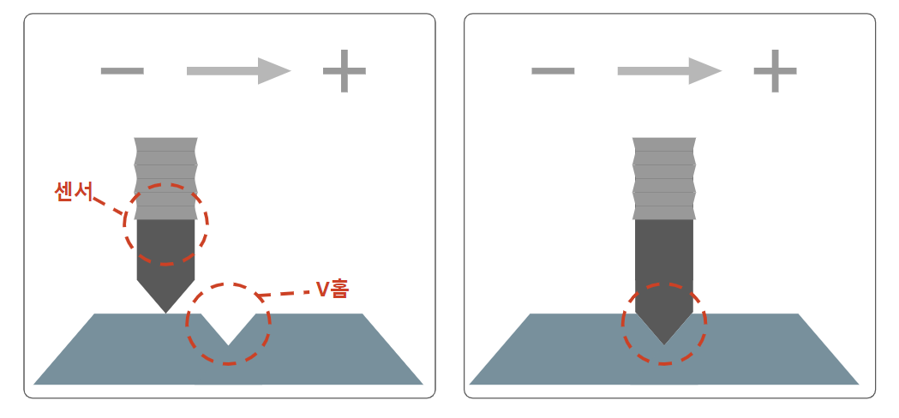

# 1. 개요
## 1.1 로봇 마스터링 기능
---

- 이 설명서에서는 로봇 마스터링 기능에 대하여 다루고 있습니다. 

 

- 기본적인 로봇 조작에 대한 지식을 기반에 둔 채 설명을 진행하오니  
  Hi6 로봇 제어기의 구성과 조작에 대한 내용은 [Hi6 제어기 조작 설명서 및 보수 설명서](https://hrbook-hrc.web.app/#/)를 참고 바랍니다.

 

### 1.1.1 로봇 마스터링 기능이란?

- 로봇 출하 시 혹은 현장에서 축 뒤틀림 현상 혹은 구동원 교체 같은 사유가 발생하는 경우, 
  로봇의 기계적 원점이 달라지는 경우가 있습니다. 이 때에 마스터링 기능을 필요로하게 됩니다. 
  마스터링이란 기계적 원점을 보정하며 로봇 모션의 정확도를 높이기 위해 사용되는 기능입니다.

 

- 해당 문서는 접촉식 센서를 기반으로 마스터링을 진행합니다.  
  센서가 시작점을 기준으로 -1.5 도에서 +1.5 도로 움직이면서 V홈을 탐지합니다.  
  최종 V홈으로 탐지된 곳이 기계적 원점으로 보정됩니다.

 
Fig 1-1. 마스터링 시작 전 V홈 탐지전(좌측), 마스터링 진행 중 V홈 탐지(우측)

