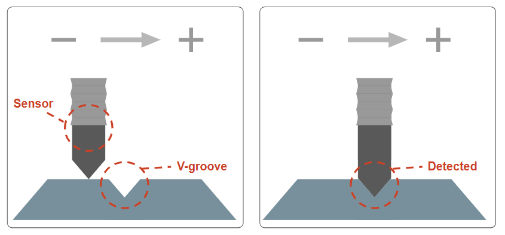

# 1. Introduction
- This manual covers the robot mastering function.
- This guidebook is predicated on fundamental understanding robot functioning. 
- Please click the following [link](https://hrbook-hrc.web.app/#/) for details on setting up and using the Hi6 robot controller.

 

### 1.1 About Robot Mastering

- The robot's mechanical origin could vary if situations like axis distortion or drive source replacement take occurred during shipping or in the field. The mastering function is required at this time.
- The mastering function is used to improve the precision of robot motion and repair the mechanical origin.
- A digital contact sensor is used to operate the mastering in this manual. 
  The sensor is attached to each axis of the robot and detects the V-groove   while moving from -1.5 degrees to +1.5 degrees based on the starting point. 
  The detected V-groove position is corrected to the mechanical origin.

 
Fig 1-1. a. Starting point(axis distortion status), 
&nbsp;&nbsp;&nbsp;&nbsp;&nbsp;
b. V-groove detection during mastering

