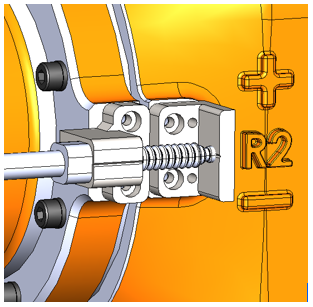
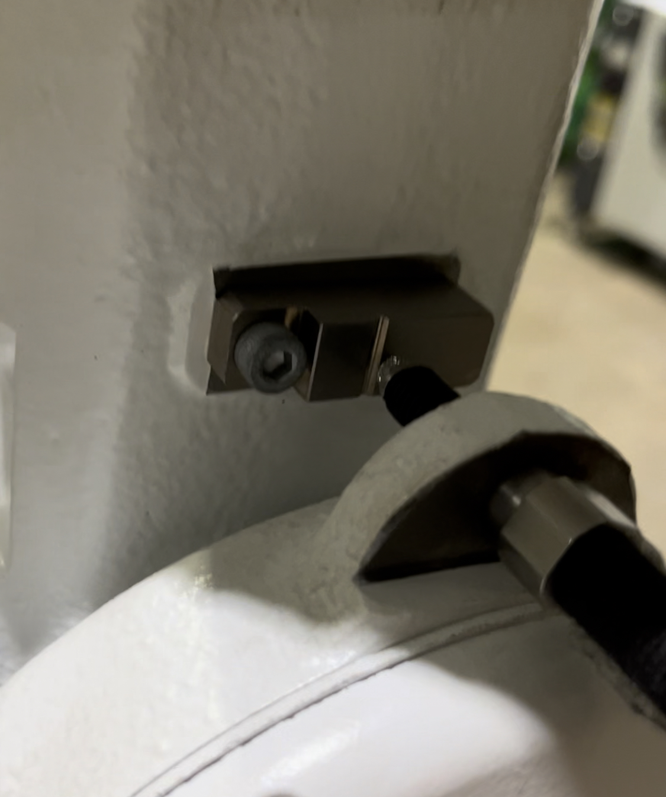

## 1.2 접촉식 센서 기반 로봇 마스터링 기능
---

- 본 사용설명서는 접촉식 센서 기반 로봇 마스터링 기능에 대한 내용을 담고 있습니다. 
- 해당 마스터링 키트와 기능의 활용으로 보다 정밀한 보정이 가능합니다.

 

### 1. 시스템 환경
- **로봇**  - 마스터링 블록 장착 모델
- **Hi6 로봇 제어기**  - app 설치
- **마스터링 키트**  - 컨트롤러 + 전원

 

### 2. 동작 환경
- 로봇의 동작 모드는 `수동 모드`로 설정이 되어 있어야 합니다.
- 반드시 `이네이블 스위치`를 활성화 한 `모터 온 상태`에서 동작을 수행할 수 있습니다.

 

### 3. 동작에 대한 설명
- 해당 기능은 접촉식 센서를 통해 로봇의 각 축별 부착된 마스터링 블록의 V홈을 스캐닝하여 보다 정확한 원점을 찾아내게 됩니다.

 

### 4. 접촉식 마스터링 구동 원리
- 접촉식 센서는 아래 그림과 같이 체결 됩니다.
- 센서가 `V홈`(아래 그림의 파인 부분)을 상하 또는 좌우로 지나갑니다.
- `V홈`을 지나면서 달라지는 센서 값을 기준으로 `V홈`의 중앙 지점을 파악합니다.
- 파악이 완료되면, 해당 중앙 지점을 기준으로 인코더 오프셋을 진행하여 원점 보정을 진행합니다.

 Fig 1-1. 마스터링 키트 장착 예시 (좌측: 렌더 이미지, 우측: 실제 체결 이미지)

