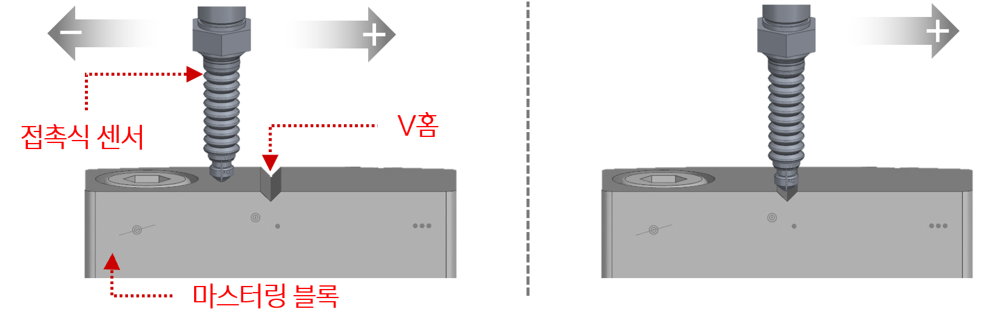

## 1.1 로봇 마스터링 기능이란?

- 마스터링이란 기구적 원점을 보정하여 로봇의 모션 정확도를 높이기 위해 사용되는 기능입니다. 
- 최초로 기구적 원점을 정의하는 경우 마스터링을 수행해야 합니다.  
- 이후 축 뒤틀림, 구동원 교체, 기구적 마모 등으로 인해 로봇의 기구적 원점이 변동될 수 있으며, 
  이러한 경우 마스터링을 다시 수행해야 합니다.
- 마스터링 vs 캘리브레이션
    - 마스터링은 앞서 설명한 바와 같이 좌표 계산의 기준이 되는 기구적 원점을 설정하는 작업입니다.
    - 캘리브레이션은 해당 기준을 유지한 상태에서 위치 오차를 보정하는 작업입니다.
    - 캘리브레이션은 반드시 마스터링 완료 후 수행해야 합니다.

 

- 해당 문서는 접촉식 센서를 기반으로 마스터링을 진행합니다.  
  센서가 시작점(= 시작위치 - 1.5도 )에서 +3도 방향과 그 역방향으로 움직이면서 V홈을 탐지합니다.  
  최종 V홈으로 탐지된 곳이 기계적 원점으로 보정됩니다.

 
Fig 1-1. 마스터링 시작 전 V홈 탐지전(좌측), 마스터링 진행 중 V홈 탐지(우측)

