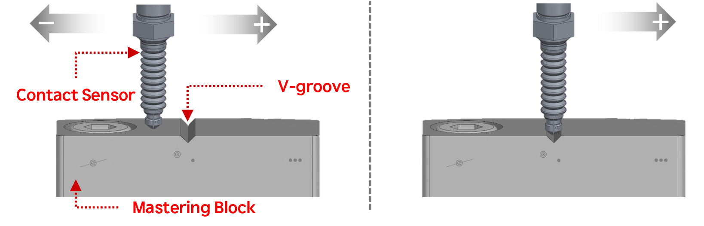

## 1.1 关于机器人校正

- 校正是通过补偿每个轴的机械零点（原点）位置来提高机器人运动精度的功能。
- 当首次定义机械零点时，必须执行校正。

- 在初始校正后，机械零点可能因  
  轴扭曲、更换驱动组件或机械磨损等因素而改变。
- 在这种情况下，必须重新执行校正以恢复准确的运动控制。

- 校正与标定
    - 校正是建立机械零点的位置，作为坐标计算的参考过程。
    - 标定是在保持已建立的机械零点参考的同时，纠正位置误差的过程。
    - 在完成校正后，必须始终执行标定。

- 本手册使用数字接触传感器进行校正。 
  传感器连接到机器人的每个轴，检测V型槽   在起始点的基础上，从-1.5度移动到+1.5度。 
  检测到的V型槽位置被修正为机械原点。 

 
图1.1. a. 起始点（轴扭曲状态），
&nbsp;&nbsp;&nbsp;&nbsp;&nbsp;
b. 在校正期间检测到的V型槽

