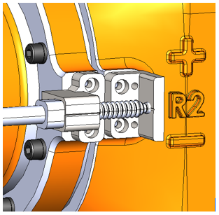

## 1.2 접촉식 센서 기반 로봇 마스터링 기능

본 사용설명서는 `접촉식 센서 기반` 로봇 마스터링 기능에 대한 내용을 담고 있습니다.  
해당 마스터링 키트와 기능의 활용으로 보다 정밀한 보정이 가능합니다.

 

### 1.2.1. 시스템 환경
- **로봇**  - 마스터링 블록 장착 모델
- **Hi6 로봇 제어기**  - app 설치
- **마스터링 키트**  - 컨트롤러 + 전원

 

### 1.2.2. 동작 조건
- 로봇의 동작 모드는 `수동 모드`로 설정이 되어 있어야 합니다.
- 반드시 `이네이블 스위치`를 활성화 한 `모터 온 상태`에서 동작을 수행할 수 있습니다.
- 로봇 구동 전 직접 조그하여 `육안 상으로 V홈을 맞춘다음 엔코더 오프셋을 1차적으로 진행`합니다.  
  V홈을 벗어나는 경우 센서 파손 또는 마스터링 오류 발생 가능성이 증가합니다.

 

### 1.2.3. 요약 과정
- 로봇의 각 축 별로 존재하는 V홈을 접촉식 센서가 스캐닝을 하여 그 중간 점을 찾아 원점으로 보정하는 동작을 합니다.

 

### 1.2.4. 전체 과정
#### 1. `육안 상` 엔코더 오프셋 보정
- 1-a) 사용자가 V홈 또는 로봇에 장착된 스케일 바를 기준으로 TP로 조그를 진행합니다(기준점 세팅).  
- 1-b) 축 별로 육안 상으로 맞춰진 위치에 대해 엔코더 오프셋 보정을 진행합니다.  
- 엔코더 오프셋 보정)   
: TP > 엔지니어모드 진입(R: 314) > 2: 시스템 > 3: 로봇 파라미터 > 4: 엔코더 옵셋 > 현재 축의 `보정된 엔코더 값` 클릭 > `단일 초기화` 클릭 
  
  
#### 2. 마스터링 키트 장착  

 Fig 1-1. 마스터링 키트 장착 예시 (좌측: 렌더 이미지, 우측: 실제 체결 이미지)

  

 

#### 3. `마스터링 기반` 엔코더 오프셋 보정
- 3-a) 1.의 과정을 마친 후, 마스터링 플러그인에 들어가서 `1.인코더 오프셋 이동` 버튼을 클릭합니다.
- 3-b) 육안으로 맞춘 V홈에 맞게 로봇이 이동한 것을 확인하고 `2. 마스터링 시작` 버튼을 클릭합니다.
- 3-c) 마스터링 진행  
    > c.1) `시작점` 이동: 현재 위치를 기준으로 `-1.5도` 지점을 시작점으로 설정해 움직입니다.  
    > c.2) `도착점` 설정: 시작점을 기준으로 `+3.0도` 지점을 도착점으로 설정합니다.  
    > c.3) `정방향` 스캔: `시작점 -> 도착점` 방향으로 스캔을 진행합니다.  
    > c.4) `역방향` 스캔: `도착점 -> 시작점` 방향으로 스캔을 진행합니다.  
    > c.5) `엔코더 오프셋 보정`: 스캔 후 탐지된 V홈 엔코더 비트를 기준으로 인코더 오프셋을 진행합니다.  
    > c.6) `엔코더 오프셋으로 이동`: 새롭게 설정된 엔코더 오프셋 위치(V홈)로 이동합니다. 
- 3-d) 마스터링 후 보정된 엔코더 오프셋 수치 제어기에 저장  
    > d.1) TP > 엔지니어모드 진입(R: 314) > 2: 시스템 > 3: 로봇 파라미터 > 4: 엔코더 옵셋  
    > d.2) 적용(shift + 확인) 버튼 클릭 후 확인  
    > !주의! 해당 과정이 생략되면 제어기 재부팅 시 엔코더 오프셋 수치가 사라집니다.  

 

#### 4. 마스터링 후 엔코더 오프셋 보정 여부 확인
- 엔코더 오프셋은 축 원점과는 독립된 데이터로, `0x400000` 기준으로부터 얼마나 떨어져 있는지를 16진수로 표현한 값입니다.
- 마스터링은 현재 엔코더 값을 `0x400000` 기준으로 재보정하고 이에 맞춰 `엔코더 오프셋` 값을 갱신하는 작업입니다.
- `3. 마스터링 기반 엔코더 오프셋 보정` 과정을 완료하고 엔코더 오프셋 값들로 이동했을 때 하기 두 가지를 확인하면 됩니다.
    1. `현재 엔코더` 값이 `0x400000` 인지 확인.
    2. `엔코더 오프셋` 값이, `마스터링 된 후의 값`인지 확인.
- 확인 과정    
a.1) TP > 엔지니어모드 진입(R: 314) > 2: 시스템 > 3: 로봇 파라미터 > 4: 엔코더 옵셋  
a.2) `로봇이동` 클릭   
a.3) `보정된 엔코더`의 값들이 `마스터링 된 후의 엔코더 오프셋` 값들인지 확인.  
a.4) 그 때의 현재 엔코더 값이 `0x400000` 값으로 설정되어있는지 확인.