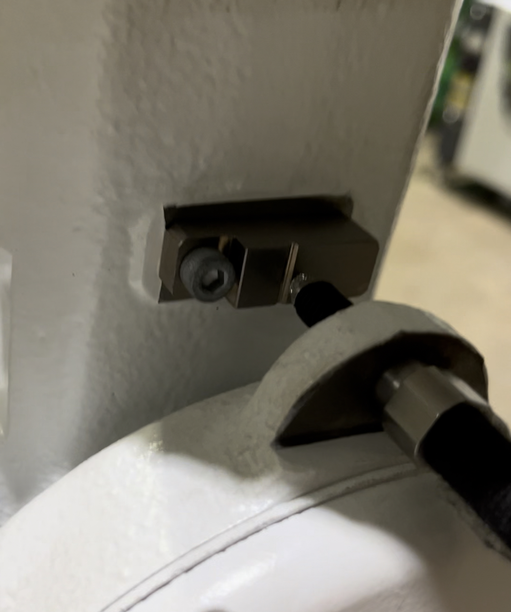

## 1.2 Contact sensor-based robot mastering 
This user manual contains information on the `contact sensor-based` robot mastering function.  
More accurate corrections are possible by using the corresponding `digital contact sensor`.

 

### 1.2.1. Mastering equipment
- **Robot**  - where Mastering device will be connected
- **Hi6 robot controller**  - where Mastering-App will be installed
- **Mastering kit**  - Power + Sensor + Communication module

 

### 1.2.2. Operating mode
- The operation mode of the robot must be set to `manual mode`.
- The procedure can only be carried out with the `motor on status` and the `enable switch` turned on.

 

### 1.2.3. Operating concept
- The digital contact sensor scans the `V-groove` of the mastering block mounted to each axis of the robot to locate a more precise origin. ([Fig 1-1](../1-about_mastering/README.md))

 

### 1.2.4. Operating description
- Contact sensors are attached in the following manner 

    

    
     Fig 1-2. Mastering kit installation example (left: render image, right: real image)
    

 

- The sensor moves up and down or side to side passing through the `V-groove`.
- Based on the sensor value that varies as it goes through the `V-groove`, the central location of the groove is determined.
- After identification, encoder offset is performed to correct the origin based on the center point.

