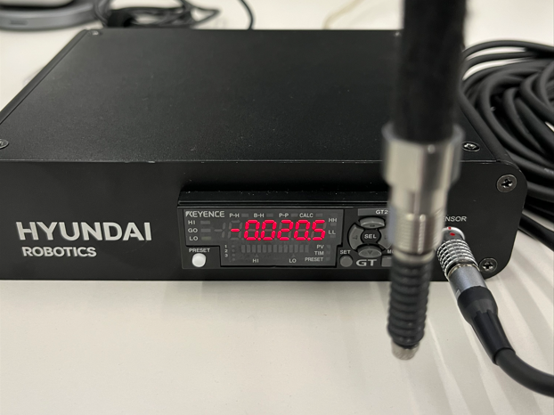
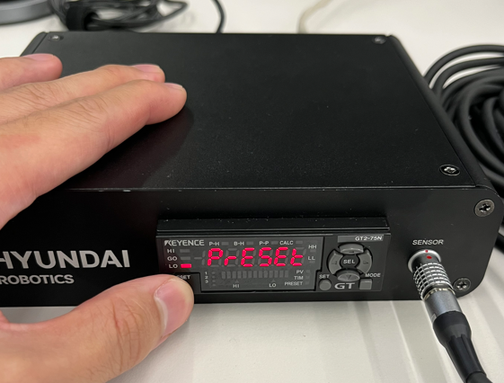
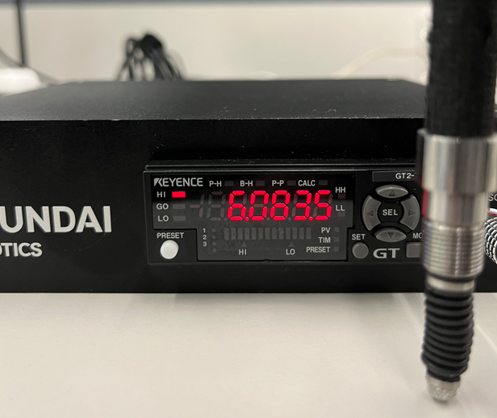
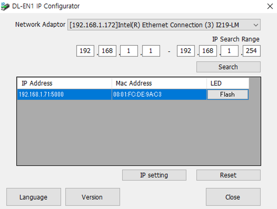

## 2.2 초기 설정 및 연결
---
### 2.2.1. 접촉식 센서 초기화
- **초기화는 <u>체결 전 하나의 축에 대해서 한번만</u> 진행하면 됩니다.** 
- !!! 주의 !!! 
  - 체결 후, 센서의 측정값이 Fig 2-3.a 처럼 `음수`가 나오면 마스터링 진행이 불가합니다.
  - 따라서, Fig 2-3.a 와 같이 `센서를 들고 있는 상태`에서 `프리셋 버튼`을 눌러 주시기 바랍니다.
  - 프리셋 이 후, 센서에 압력이 가해졌을 때 Fig 2-3.c 처럼 양수 값이 측정되는지 확인합니다.
  - **축을 바꿔 체결할 때마다, 측정 되는 수치가 양수인지 반드시 확인 해야합니다.**

Fig 2-3. a. 센서를 들었을 때의 음의 수치 
&nbsp;&nbsp;&nbsp;&nbsp;&nbsp;&nbsp;&nbsp;&nbsp;&nbsp;&nbsp;&nbsp;&nbsp;
b. preset 버튼을 누르는 장면
&nbsp;&nbsp;&nbsp;&nbsp;&nbsp;&nbsp;&nbsp;&nbsp;&nbsp;&nbsp;&nbsp;&nbsp;
c. 센서를 눌렀을 때 양의 수치

 
 

### 2.2.2. 접촉식 센서 통신 설정
- 마스터링 컨트롤러의 설정 프로그램은 소프트웨어 패키지에 포함되어 있습니다. 별도의 PC에 해당 프로그램을 설치합니다.
- **<u>보안 프로그램이 적용된 사내 노트북이나 데스크탑은 IP Search 가 되지 않습니다</u>**
- 별도의 PC와 마스터링 컨트롤러를 연결한 뒤 해당 프로그램을 통해 통신 IP주소와 포트 번호를 설정할 수 있습니다.
- 해당 프로그램은 회원가입 후 사용하실 수 있습니다.
- 통신 설정 후 [Fig 2-1의 통신 모듈](../02_1_kit_description/description.md)과 같이 마스터링 통신 모듈과 Hi6 제어기를 이더넷 케이블로 연결합니다.

 

Fig 2-4. 마스터링 컨트롤러 설정 프로그램 [DL-EN1 IP configurator](https://www.keyence.co.kr/download/download/confirmation/?dlAssetId=AS_135945&dlSeriesId=&dlModelId=&dlLangId=&dlLangType=en-GB)
 - `Network Adaptor` : 연결 PC의 네트워크 어댑터 정보
 - `IP Search Range` : IP 주소 검색 범위(기 설정 되어있는 IP 주소를 검색)
 - `IP Address/Mac Address` : 기설정된 IP주소과 Mac주소
 - `IP Setting/Reset` : IP 설정 버튼(수정) 및 초기화 버튼 (IP 설정을 바꿀 경우에만 실행)

 
 

### 2.2.3 제어기 설정
- 해당 기능은 Hi6 SDK를 통해 개발되었으며, 마스터링 App을 Hi6 제어기에 별도로 설치를 해야 사용할 수 있습니다.
 

- 설치 위치
 /ata0:2/lib/hi6/apps/mastering
 

- 설치 방법
 1) Ethernet 연결 후 FTP 통신 방식을 통해 설치.
 2) USB 에 mastering app 을 저장하여 TP 의 `5: 파일관리` 에서 복사 붙여넣기 진행.
 

- 설치 주의 사항
 설치 후 제어기를 재부팅해야 마스터링 APP을 실행 시킬 수 있습니다.
 재부팅 이후 응용프로그램에서 마스터링 APP이 보이지 않을 시, TP 만 재부팅 하십시오.
 

