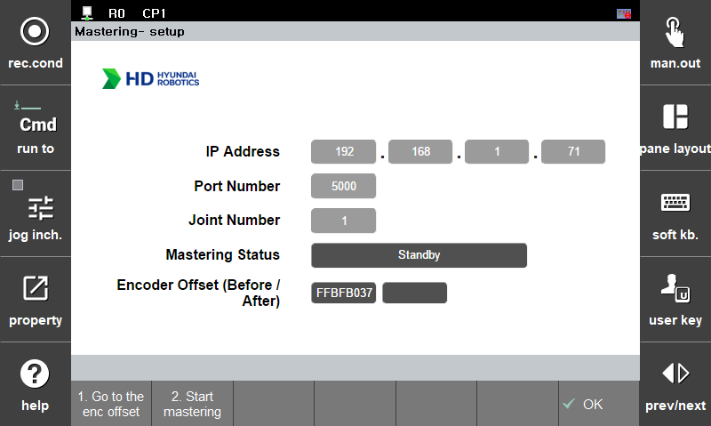

## 2.3 Mastering app configuration
---
- Once the mastering APP installation is successfully completed, the mastering function can be performed.
- After finishing several configuration setting for mastering, mastering could be performed easily with few buttons.
- Mastering can be performed correctly only when you understand the conditions and contents of the movement.
 
 

### 2.3.1 App setting configuration
- App location
  TP : `home` > `system` > `4: Application parameter` > `23: Mastering`

 

- The App & standby mode image

 
Fig 2-5. Mastering app image
 

- If you do not see the mastering APP in the application program, just reboot the TP.

 
Fig 2-6. Mastering standby mode image

- `IP Address` : Enter the ip address of the mastering communicator.
- `Port Number` : Enter the port number of the mastering communicator.
- `Joint Number` : Enter the number of target joint.
- `Mastering Status` : Display the mastering operation status.
- `Encoder Offset (Before / After)` : Display the encoder offset value (`bit`) of the current axis before and after mastering.
 

- How to save mastering IP and port number settings
 - 1) Enter the preset ip, port. - 
[2.2.2. Communication settings for contact sensor](../02_2_kit_initialization/description.md/#222-communication-settings-for-contact-sensor)
 - 2) Save the configuration through the `shift` + `OK` to the hi6 controller.
