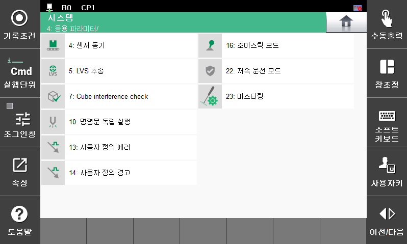
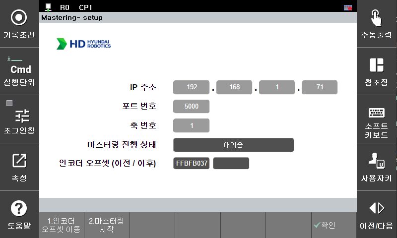

## 2.3 제어기 설정
---
- 마스터링 APP 설치가 정상적으로 완료되면, Hi6 로봇 제어기의 설정창을 통하여 마스터링 기능을 수행할 수 있습니다.
- 동작을 수행하기 전에 마스터링 설정값들이 반영 되어 있어야하고, 실행 버튼들을 통하여 마스터링의 동작을 수행하게 됩니다.
- 동작의 조건과 내용에 대한 이해가 있어야 마스터링을 올바르게 수행할 수 있습니다
 
 

### 2.3.1 마스터링 기능 설정
- 설정 위치
  TP : `홈` > `시스템` > `4: 응용 파라미터` > `마스터링`

 

- app 및 대기 화면 

 
응용프로그램에서 마스터링 APP이 보이지 않을 시, TP 만 재부팅 하십시오. 

 Fig 2-5. 마스터링 App 및 대기 화면
 - `IP 주소` : 마스터링 키트의 IP 주소를 입력합니다.
 - `포트 번호` : 마스터링 키트의 포트 번호를 입력합니다.
 - `축 번호` : 마스터링을 수행할 대상 축을 설정합니다.
 - `마스터링 진행 상태` : 마스터링 수행 시 상태를 표시합니다.
 - `인코더 오프셋(이전 / 이후)` : 마스터링 수행 전 후의 현재 축의 인코더 오프셋 값(`bit`)을 보여줍니다.

 

- 마스터링 IP 및 포트 번호 설정 저장 방법
 - 1) Fig 2-5. 와 같이, 마스터링 키트의 ip, port, 축 번호를 입력합니다.
 &nbsp;&nbsp;&nbsp;&nbsp;&nbsp;&nbsp;&nbsp;
[2.2.2. 접촉식 센서 통신 설정](../02_2_kit_initialization/description.md/#222-접촉식-센서-통신-설정)에서 설정한 ip 및 port 를 입력합니다.
 - `shift` + `확인` 클릭을 통해 설정 값을 제어기에 저장 및 업데이트 합니다.

