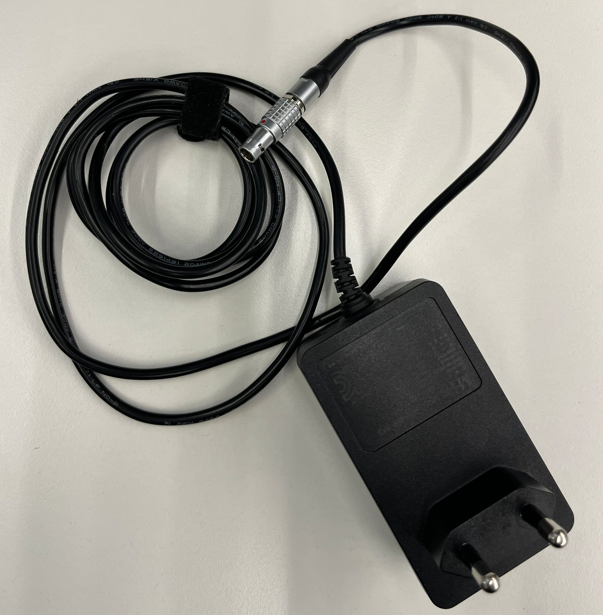
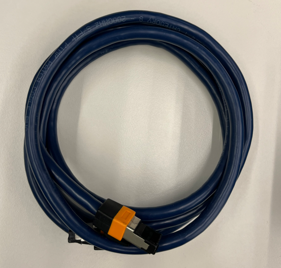

# 2. System configuration
## 2.1 Mastering Kit
---
### 2.1.1 Contact sensor components
- **Sensor & Power adapter** 

Fig 2-1. a. Contact sensor&nbsp;&nbsp;&nbsp;&nbsp; b. Communication module
 

 

- **Cable**   

Fig 2-2.&nbsp;&nbsp; a. power adapter&nbsp;&nbsp;&nbsp;&nbsp;&nbsp;b. ethernet cable
 

 

- **S/W**
 This package includes a mastering App and a controller setup program.

 

### 2.1.2 Contact sensor connections
- Connect the sensor as shown in the photo on the Fig 2-1 b.

 

### 2.1.3 Specifications
- The mastering kit has the interface specifications below.

|feature|detail|
|:----:|:----|
|Sensor Type| Digital contact |
|Protocol| Ethernet(TCP/IP) |
|Cycle| 5 msec |

 
 