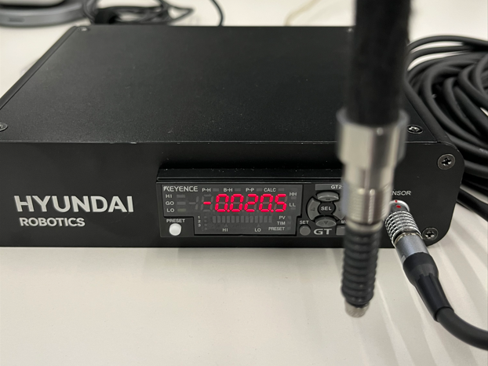
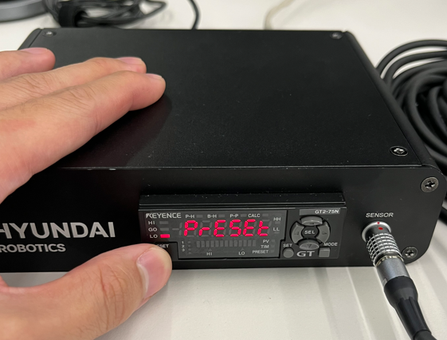
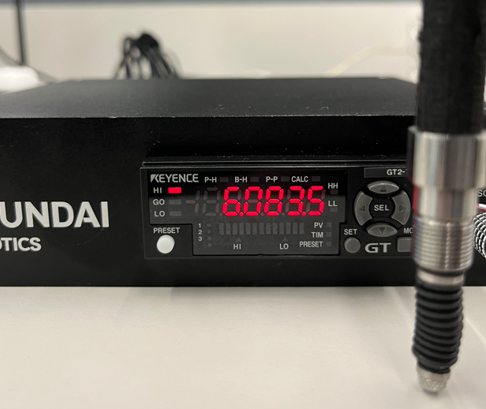
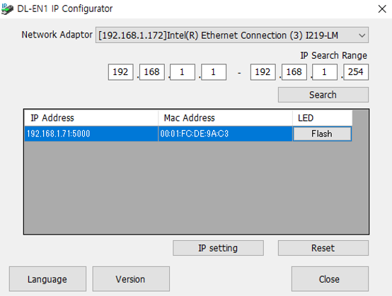

## 2.2 Initial setup and Connection
---
### 2.2.1. Contact sensor initialization
- **Initialization only needs to be done <u>once for one axis before fixing.</u>** 
- !!! Caution !!! 
  - After connection, if the sensor's measurement value is a `negative number` as shown in Fig 2-3.a, `mastering cannot proceed`.
  - Therefore, please press the ‘preset button’ while ‘holding the sensor’ as shown in Fig 2-3.a.
  - After presetting, check whether a `positive value` is measured `when sensor is pressed`, as shown in Fig 2-3.c.
  - **After finishing mastering each robot axis, you need to ensure that the measured value is `positive`.**

 
Fig 2-3. a. Negative value when holding the sensor 
&nbsp;&nbsp;&nbsp;&nbsp;&nbsp;&nbsp;&nbsp;&nbsp;&nbsp;&nbsp;&nbsp;&nbsp;
b. when pressing the preset button
&nbsp;&nbsp;&nbsp;&nbsp;&nbsp;&nbsp;&nbsp;&nbsp;&nbsp;&nbsp;&nbsp;&nbsp;
c. Positive value when sensor is pressed

 
 

### 2.2.2. Communication settings for contact sensor
- The software bundle includes the mastering setup application. Install the software on a different computer.
- **<u>If you utilize a company computer, please note that the 'IP Search' function is generally not permitted by company security policies.</u>**
- In the case of above, you can set the ip configure by using personal computer.
- Following membership registration, you are able to use this program.
- After finishing communication setting, please connect the hardwares(communicator, ethernet cable) like [Fig 2-1 b.Communication module](https://hrbook-hrc.web.app/#/view/doc-hi6-mastering/english/02_about_kit/02_1_kit_description).

Fig 2-4. [IP configurator](https://www.keyence.co.kr/download/download/confirmation/?dlAssetId=AS_135945&dlSeriesId=&dlModelId=&dlLangId=&dlLangType=en-GB)
 - `Network Adaptor` : Network adaptor info for connected computer.
 - `IP Search Range` : Searching for the connected device's IP address.
 - `IP Address/Mac Address` : IP address and MAC address of the connected device
 - `IP Setting/Reset` : IP settings button (edit) and reset button (<u>**only for changing IP settings**</u>)

 
 

### 2.2.3 Hi6 Controller
- The mastering function was developed through Hi6 SDK, and this app must be installed on the Hi6 controller to use it.
- Install location for hi6 controller
 /ata0:2/lib/hi6/apps/mastering
- Install method
 1) After an ethernet connection, transfer the source code using FTP transmission.
 2) After saving the source code to the USB, connect to the TP. Then copy and paste the source code utilizing TP's `5: File Management` function.
- Installation precautions
 To use the mastering APP after installation, the controller must be restarted.
 Reboot the TP if you still don't see the mastering APP in the application program after doing so.
 

