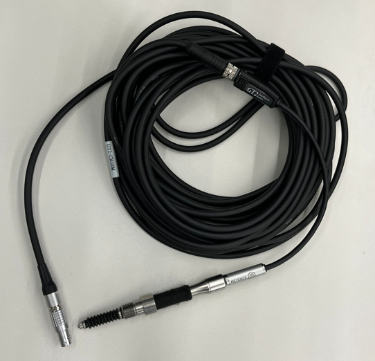
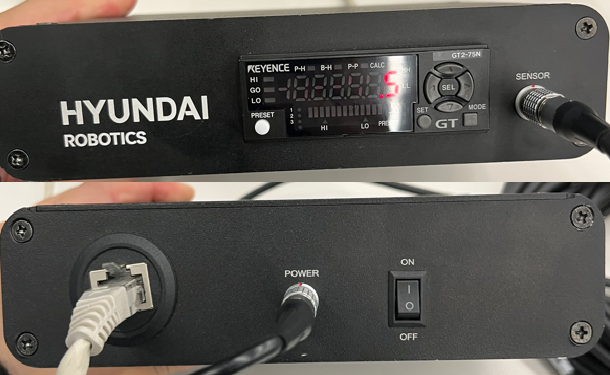
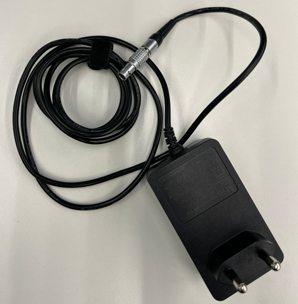
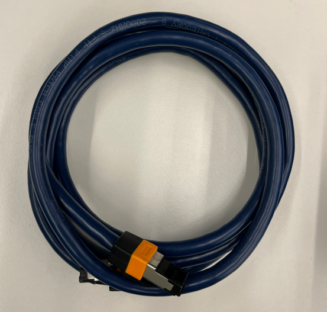

## 2.1 키트 구성

### 2.1.1 접촉식 센서 구성품

- **센서 및 전원 어댑터** 
    

    
    
    

    Fig 2-1. 마스터링 센서와 통신 모듈
     

     

- **케이블**   
    

    
    

    Fig 2-2. 전원 어댑터와 이더넷 케이블
     

 

- **소프트웨어**
 본 패키지에는 마스터링 기능 APP 과 컨트롤러 설정 프로그램이 포함되어있습니다.

 
 

### 2.1.2 접촉식 센서 연결 및 사양
- 센서 연결을 Fig2-1 의 우측 사진과 같이 연결하면 됩니다.
- 마스터링 키트는 하기와 같은 인터페이스 사양을 가지고 있습니다.

    |속성|내용|
    |:----:|:----|
    |`센서 타입`| `접촉식` 센서 |
    |`통신 지원`| `Ethernet`(TCP/IP) |
    |`통신 주기`| `5 msec` |

 
 