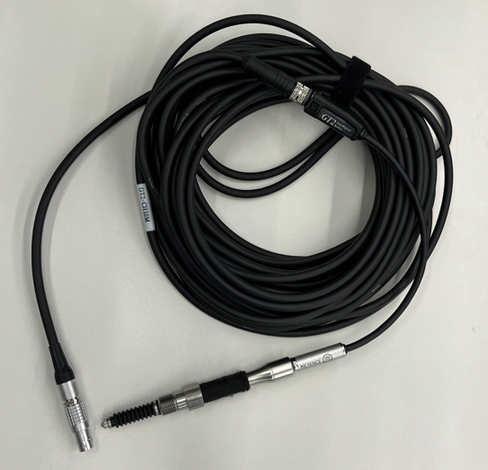
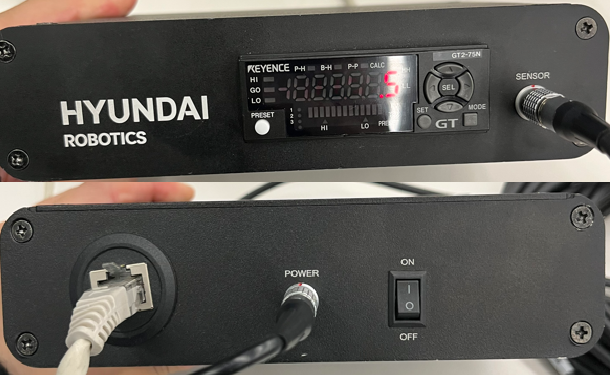
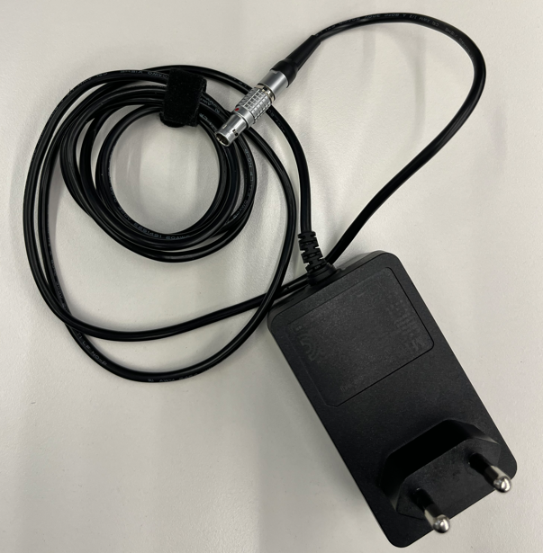
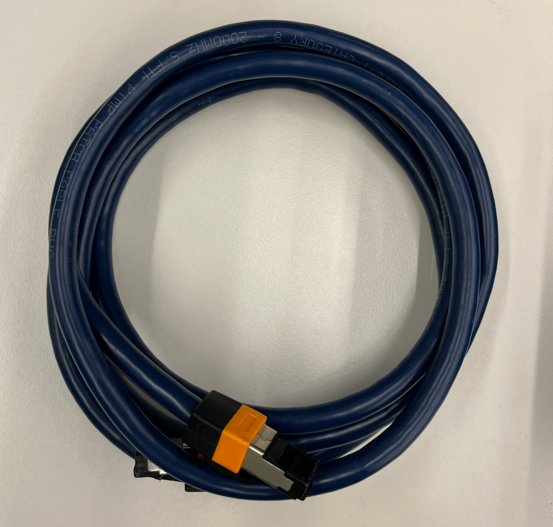

## 2.1 Mastering Kit

#### 2.1.1 Contact sensor components
- **Sensor & Power adapter** 
    <table style="margin-left: 0; border: none; border-collapse: collapse; width: 430px; table-layout: fixed;">
      <tr>
        <td style="width: 215px; border: none; vertical-align: bottom; padding: 0;">
          
        </td>
        <td style="width: 215px; border: none; vertical-align: bottom; padding: 0;">
          
        </td>
      </tr>
      <tr style="white-space: nowrap; font-size: 0.9em;">
        <td style="border: none; padding-top: 5px;">
          Fig 2.1.1.&nbsp;&nbsp;a. Contact sensor
        </td>
        <td style="border: none; padding-top: 5px;">
          b. Communication module
        </td>
      </tr>
    </table>

- **Cable**   
    <table style="margin-left: 0; border: none; border-collapse: collapse; width: 430px; table-layout: fixed;">
      <tr>
        <td style="width: 215px; border: none; vertical-align: bottom; padding: 0;">
          
        </td>
        <td style="width: 215px; border: none; vertical-align: bottom; padding: 0;">
          
        </td>
      </tr>
      <tr style="white-space: nowrap; font-size: 0.9em;">
        <td style="border: none; padding-top: 5px;">
          Fig 2.1.2.&nbsp;&nbsp;a. power adapter
        </td>
        <td style="border: none; padding-top: 5px;">
          b. ethernet cable
        </td>
      </tr>
    </table>

- **S/W**  
This package includes a mastering App and a controller setup program.

#### 2.1.2 Contact sensor connections
- Connect the sensor as shown in the photo on the Fig 2-1 b.

#### 2.1.3 Specifications
- The mastering kit has the interface specifications below.
    

    |feature|detail|
    |:----|:----|
    |`Sensor Type`| `Digital contact` |
    |`Protocol`| `Ethernet` (TCP/IP) |
    |`Cycle`| `5 msec` |

    

 
 
