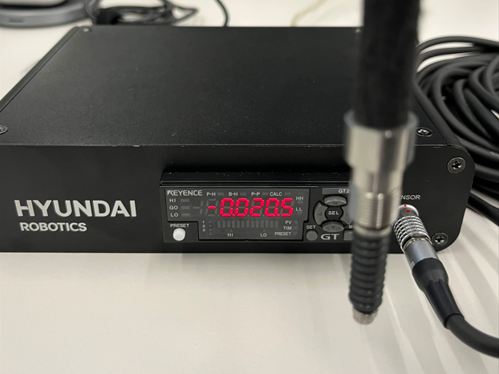
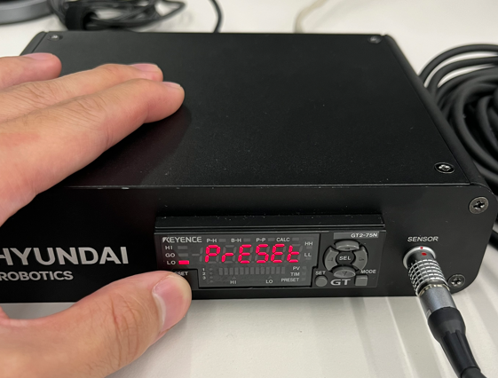
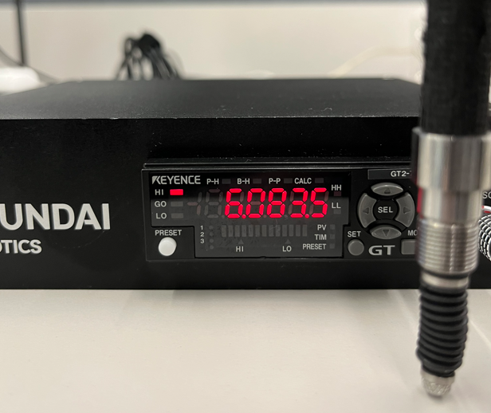
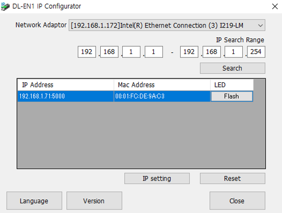

## 2.2 初始设置和连接

#### 2.2.1. 接触传感器初始化
**初始化只需在固定前对一个轴<u>进行一次。</u>**   

请记住

1) 连接后，如果传感器的测量值为图2-3.a所示的`负数`，则`无法进行归零`。  
2) 因此，请在按图2-3.a所示的情况下，按下"预设按钮"的同时"保持传感器"。  
3) 预设后，请检查在传感器被按下时，测量到的值是否为`正值`，如图2-3.c所示。  
4) **在完成每个机器人轴的归零后，需要确保测量值为`正数`。**

    

    
    
     
    图 2.2.1. a. 持续传感器时的负值 
    &nbsp;&nbsp;&nbsp;&nbsp;&nbsp;&nbsp;&nbsp;&nbsp;&nbsp;&nbsp;&nbsp;&nbsp;
    b. 按下预设按钮时
    &nbsp;&nbsp;&nbsp;&nbsp;&nbsp;&nbsp;&nbsp;&nbsp;&nbsp;&nbsp;&nbsp;&nbsp;
    c. 传感器被按下时的正值
    

 
 

#### 2.2.2. 接触传感器的通信设置  
- 软件包包括归零设置应用程序。请在另一台计算机上安装软件。  
- **<u>如果您使用公司计算机，请注意公司安全政策通常不允许使用"IP搜索"功能。</u>**  
- 在这种情况下，您可以使用个人计算机配置IP设置。  
 - 注册成为会员后，您将能够使用该程序。  
    - 完成通信设置后，请按照[图2-1 b.通信模块](../1-kit_description/README.md)连接硬件（通讯器、以太网电缆）。  

    

    

    图 2.2.2. [IP配置器](https://www.keyence.co.kr/download/download/confirmation/?dlAssetId=AS_135945&dlSeriesId=&dlModelId=&dlLangId=&dlLangType=en-GB)
    - `网络适配器` : 连接计算机的网络适配器信息。
    - `IP搜索范围` : 搜索连接设备的IP地址。
    - `IP地址/Mac地址` : 连接设备的IP地址和MAC地址
    - `IP设置/重置` : IP设置按钮（编辑）和重置按钮（<u>**仅用于更改IP设置**</u>）
    

