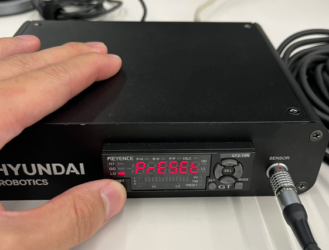

## 2.2 Initial setup and Connection
### 2.2.1. Contact sensor initialization
**Initialization only needs to be done <u>once for one axis before fixing.</u>**   

Keep in mind

1) After connection, if the sensor's measurement value is a `negative number` as shown in Fig 2-3.a, `mastering cannot proceed`.  
2) Therefore, please press the ‘preset button’ while ‘holding the sensor’ as shown in Fig 2-3.a.  
3) After presetting, check whether a `positive value` is measured `when sensor is pressed`, as shown in Fig 2-3.c.  
4) **After finishing mastering each robot axis, you need to ensure that the measured value is `positive`.**

    

    
    
     
    Fig 2-3. a. Negative value when holding the sensor 
    &nbsp;&nbsp;&nbsp;&nbsp;&nbsp;&nbsp;&nbsp;&nbsp;&nbsp;&nbsp;&nbsp;&nbsp;
    b. when pressing the preset button
    &nbsp;&nbsp;&nbsp;&nbsp;&nbsp;&nbsp;&nbsp;&nbsp;&nbsp;&nbsp;&nbsp;&nbsp;
    c. Positive value when sensor is pressed
    

 
 

### 2.2.2. Communication settings for contact sensor
- The software bundle includes the mastering setup application. Install the software on a different computer.
- **<u>If you utilize a company computer, please note that the 'IP Search' function is generally not permitted by company security policies.</u>**
- In the case of above, you can set the ip configure by using personal computer.
- Following membership registration, you are able to use this program.
- After finishing communication setting, please connect the hardwares(communicator, ethernet cable) like [Fig 2-1 b.Communication module](../1-kit_description/README.md).

    

    

    Fig 2-4. [IP configurator](https://www.keyence.co.kr/download/download/confirmation/?dlAssetId=AS_135945&dlSeriesId=&dlModelId=&dlLangId=&dlLangType=en-GB)
     - `Network Adaptor` : Network adaptor info for connected computer.
     - `IP Search Range` : Searching for the connected device's IP address.
     - `IP Address/Mac Address` : IP address and MAC address of the connected device
     - `IP Setting/Reset` : IP settings button (edit) and reset button (<u>**only for changing IP settings**</u>)
    
