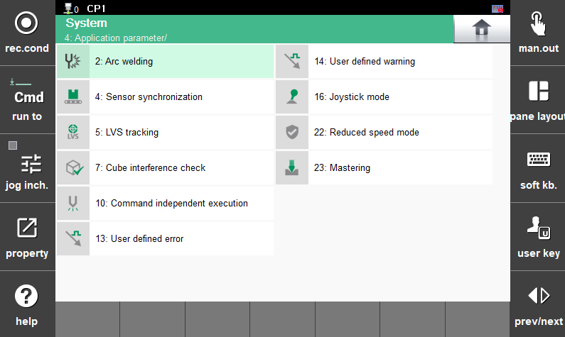
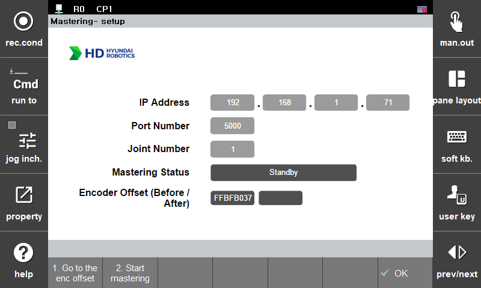

## 2.3 掌握应用程序配置

一旦成功完成掌握 APP 的安装，就可以执行掌握功能。 
只有在理解运动的条件和内容后，才能正确执行掌握。

#### 2.3.1 安装掌握应用程序
掌握功能是通过 ${cont_model} SDK 开发的，必须安装在控制器上。

- `安装位置` 对于 hi6 控制器  
    - /ata0:2/lib/hi6/apps/mastering (com version <= V60.32)
- `安装方法`  
    1) 您可以通过联系 HD Hyundai Robot SW 开发团队下载插件。  
    2) 在以太网连接后，使用 FTP 传输源代码。  
    3) 将源代码保存到 USB 后，连接到 TP。  
    4) 然后利用 TP 的 `5: 文件管理` 功能复制并粘贴源代码。
- `安装注意事项`
    1) 在安装后，要使用掌握 APP，控制器必须重启。  
    2) 如果在执行此操作后仍然在应用程序中未看到掌握 APP，请重启 TP。

#### 2.3.2 应用程序设置配置
- `应用程序位置`  
TP : `home` > `系统 (system)` > `4: 应用参数 (4: Application parameter)` > `23: 掌握`

  
- <code>待机模式</code>

  <table style="margin-left: 0; border: none; border-collapse: collapse; width: 530px; table-layout: fixed;">
    <tr>
      <td style="border: none; vertical-align: bottom; padding: 0;">
        
      </td>
    </tr>
    <tr>
      <td style="border: none; padding-top: 10px; font-size: 0.9em; font-weight: bold;">
        图 2.3.1. 掌握应用程序图像
      </td>
    </tr>
  </table>

  
- 如果看不到 APP，只需重启 TP。

  <table style="margin-left: 0; border: none; border-collapse: collapse; width: 530px; table-layout: fixed;">
    <tr>
      <td style="border: none; vertical-align: bottom; padding: 0;">
        
      </td>
    </tr>
    <tr>
      <td style="border: none; padding-top: 10px; font-size: 0.9em; font-weight: bold;">
        图 2.3.2. 掌握 <code>待机模式</code> 图像
      </td>
    </tr>
    <tr>
      <td style="border: none; padding-top: 15px; font-size: 0.9em; line-height: 1.6;">
        <ul style="margin: 0; padding-left: 20px; list-style-type: disc;">
          <li><code>IP 地址</code> : 输入掌握通信器的 IP 地址。</li>
          <li><code>端口号</code> : 输入掌握通信器的端口号。</li>
          <li><code>关节号</code> : 输入目标关节的数量。</li>
          <li><code>掌握状态</code> : 显示掌握操作状态。</li>
          <li><code>编码器偏移量（之前 / 之后）</code> : 显示当前轴在掌握之前和之后的编码器偏移量值（<code>bit</code>）。</li>
        </ul>
      </td>
    </tr>
  </table>

如何保存掌握 IP 和端口号设置  
    1. 输入预设的 ip，端口。 - [2.2.2. 接触传感器的通信设置](../2-kit_initialization/README.md)  
    2. 通过 `shift` + `确定 (OK)` 保存配置到 ${cont_model} 控制器。