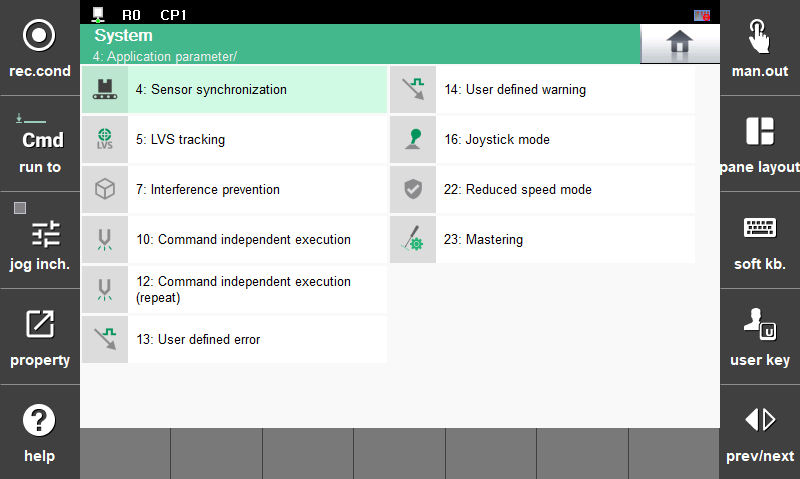

## 2.3 Mastering app configuration
Once the mastering APP installation is successfully completed, the mastering function can be performed.  
After finishing several configuration setting for mastering, mastering could be performed easily with few buttons.  
Mastering can be performed correctly only when you understand the conditions and contents of the movement.  

 

### 2.3.1 Install Mastering app
The mastering function was developed through Hi6 SDK, and this app must be installed on the Hi6 controller to use it.  

- `Install location` for hi6 controller  
/ata0:2/lib/hi6/apps/mastering

- `Install method`  
1) After an ethernet connection, transfer the source code using FTP transmission.  
2) After saving the source code to the USB, connect to the TP. Then copy and paste the source code utilizing TP's `5: File Management` function.

- `Installation precautions`  
To use the mastering APP after installation, the controller must be restarted.  
Reboot the TP if you still don't see the mastering APP in the application program after doing so.

 

### 2.3.2 App setting configuration
- `App location`  
TP : `home` > `system` > `4: Application parameter` > `23: Mastering`

 

- `Standby mode`

     
    Fig 2-5. Mastering app image  

- If you do not see the mastering APP in the application program, just reboot the TP.

     
    Fig 2-6. Mastering `standby mode` image  

    - `IP Address` : Enter the ip address of the mastering communicator.  
    - `Port Number` : Enter the port number of the mastering communicator.  
    - `Joint Number` : Enter the number of target joint.  
    - `Mastering Status` : Display the mastering operation status.  
    - `Encoder Offset (Before / After)` : Display the encoder offset value (`bit`) of the current axis before and after mastering.  

 

- How to save mastering IP and port number settings  
    1) Enter the preset ip, port. - 
    [2.2.2. Communication settings for contact sensor](../2-kit_initialization/README.md)  
    2) Save the configuration through the `shift` + `OK` to the hi6 controller.
