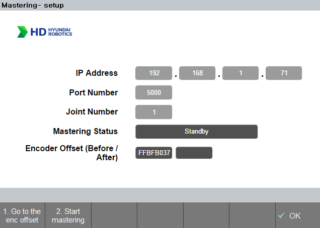

# 3. Mastering operation
## 3.1. Environment & process
---
### 3.1.1 Environment
- Before mastering is performed, the mastering kit must be installed near the `V-groove`.
 Otherwise, an `'ERROR_VAL_THRESHOLD'` error may be returned.
- Operates only in manual mode and motor on.
- Please holding the enable switch until the operation ends.

 
 

### 3.1.2 Operation process - summary
1. In [Standby mode](../02_3_com_initialization/description.md/#231-app-setting-configuration), enter the joint number then press the `shift + OK` for saving configuration.
2. Click the `1.Go to the enc offset` button.
3. After step 2., click the `2.Start mastering` button.
4. After step 3., enter the next target joint number, do step 2. again.
5. After completing the mastering process for all joints, save the corrected encoder offset values using the procedures listed below.
   - `home` > `supervisor mode(R button + 314)` > `system` > `3: Robot parameter` > `4: Encoder offset` > `shift + OK` > `OK`

 
 

### 3.1.3 Operation process - Details
- Each joint follows below procedures.
- Procedure status will be displayed on the mastering status block.
  
|Order|Mastering status|Contents|
|:---:|:---:|:---|
|(1)|Standby|Initial image when entering the mastering app.|
|(2)|go to the offset pose...|`1.인코더 오프셋 이동` 버튼 클릭 시 로봇이 움직이는 상태|
|(3)|reached the offset pose.|`1.인코더 오프셋 이동` 정상 수행 완료 상태|
|(4)|Start mastering.|`2.마스터링 시작` 버튼 클릭 시 로봇이 움직이기 시작하는 상태|
|(5)|move to P1.|`2.마스터링 시작` 버튼 클릭 후 로봇이 p1 방향으로 움직이는 상태|
|(6)|move to P2.|`2.마스터링 시작` 버튼 클릭 후 로봇이 p2 방향으로 움직이는 상태|
|(7)|apply corrected enc offset.|마스터링 완료 후 수정된 원점으로 움직이는 상태|
|(8)|mastering end.|보정된 인코더 오프셋이 설정되고 마스터링이 종료된 상태|

- (1)에서 (8)까지 수행 완료 후, 다음 축으로 변경 후 `shift + 확인`을 눌러 축 상태를 저장합니다.
- 변경 된 축 상태 저장을 완료하고, 위의 (2)번부터 (8)까지 수행합니다.
- 모든 축 마스터링이 완료되면, 아래의 과정을 통해 설정된 축들의 엔코더 오프셋 값들을 적용 및 저장.
   - `홈` > `관리자모드 진입(R버튼 + 314)` > `시스템` > `3: 로봇 파라미터` > `4: 엔코더 옵셋` > `shift + 확인` > `확인`

 
 

### 3.1.4 수행 결과 - 이미지

- `인코더 오프셋(이전/이후)`에는 인코더 오프셋 값(`bit`)이 표기됩니다.
  - 왼쪽 칸 : 마스터링 이전의 인코더 오프셋 수치
  - 오른쪽 칸 : 마스터링 이후의 인코더 오프셋 수치

 
Fig 3-1.&nbsp;&nbsp;&nbsp;&nbsp;a.대기 화면(좌측 이미지)
&nbsp;&nbsp;&nbsp;&nbsp;
b. 마스터링 종료 화면(우측 이미지)

 
 

### 3.1.5 참고
- 마스터링 결과 값을 인코더 값으로 보여주는 이유
  - 마스터링 결과 비교시, 각도 차이를 보여주는 것이 직관적이나, 0.01 이하의 변화는 측정이 불가합니다. 
  - 현재 마스터링 과정은 원점을 기준으로 -1.5도에서 1.5도를 미세하게 움직입니다.
  - 이러한 미세 차이를 표현하기 위해서는 bit 단위로 인코더 수치를 보여주는 것이 정확합니다.

