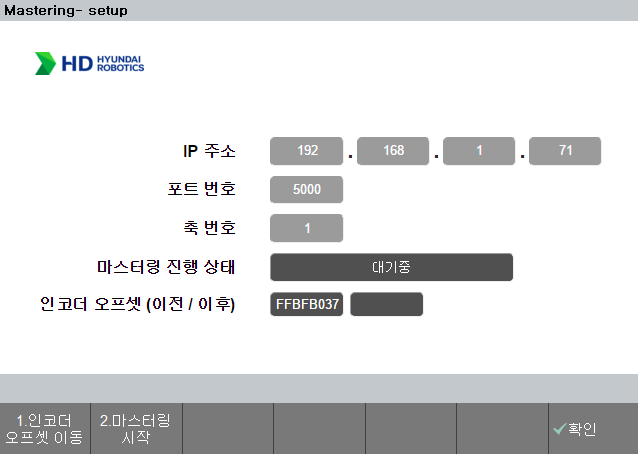
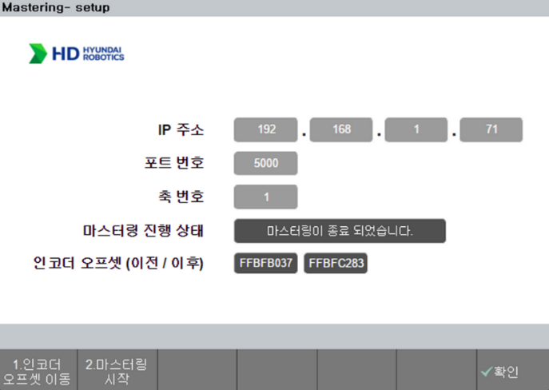

## 3.1. 동작 환경 및 과정  

### 3.1.1 동작 환경

  
마스터링 수행 전, 마스터링 `센서 팁`이 `V홈 근처`에 위치해야 합니다.  
이를 어길 시 센서 팁이 손상 가능성과 `ERROR_VAL_THRESHOLD` 에러를 반환 가능성이 있습니다.
  
- 수동 모드, 모터 온 상태에서 동작합니다.
- 동작이 종료될 때까지 반드시 이네이블 스위치를 잡아 주어야합니다.

 
 

### 3.1.2 동작 과정 - 요약
1. [대기 화면](../../02_about_kit/3-com_initialization/README.md)에서 축 번호 입력 후 `shift + 확인` 으로 적용
2. `1.인코더 오프셋 이동` 버튼 클릭 
3. 2.가 완료되면, `2.마스터링 시작`버튼 클릭
4. 3.이 완료되면, 1.을 다음 축으로 설정하고 2., 3. 진행
5. 모든 축 마스터링이 완료되면, 아래의 과정을 통해 설정된 축들의 엔코더 오프셋 값들을 적용 및 저장.
   - `홈` > `관리자모드 진입(R버튼 + 314)` > `시스템` > `3: 로봇 파라미터` > `4: 엔코더 옵셋` > `shift + 확인` > `확인`

 
 

### 3.1.3 동작 과정 - 상세
`하나의 축에 대해서` 아래의 (1)~(8)단계를 진행하게 됩니다.
  
|순서|진행 상태 표시|내용|
|:---:|:---:|:---|
|(1)|대기중|처음 app을 실행시켰을 때의 화면|
|(2)|오프셋 포즈로 움직입니다...| `1.인코더 오프셋 이동` 버튼 클릭 시 로봇이 움직이는 상태 |
|(3)|오프셋 포즈에 도달하였습니다.|`1.인코더 오프셋 이동` 정상 수행 완료 상태|
|(4)|마스터링을 시작합니다.|`2.마스터링 시작` 버튼 클릭 시 로봇이 움직이기 시작하는 상태|
|(5)|p1로 가는 중입니다.|`2.마스터링 시작` 버튼 클릭 후 로봇이 p1 방향으로 움직이는 상태|
|(6)|p2로 가는 중입니다.|`2.마스터링 시작` 버튼 클릭 후 로봇이 p2 방향으로 움직이는 상태|
|(7)|수정된 인코더 오프셋을 적용합니다.|마스터링 완료 후 수정된 원점으로 움직이는 상태|
|(8)|마스터링이 종료되었습니다.|보정된 인코더 오프셋이 설정되고 마스터링이 종료된 상태|

- (1)에서 (8)까지 수행 완료 후, 다음 축으로 변경 후 `shift + 확인`을 눌러 축 상태를 저장합니다.
- 변경 된 축 상태 저장을 완료하고, 위의 (2)번부터 (8)까지 수행합니다.
- 모든 축 마스터링이 완료되면, 아래의 과정을 통해 설정된 축들의 엔코더 오프셋 값들을 적용 및 저장.
   - `홈` > `관리자모드 진입(R버튼 + 314)` > `시스템` > `3: 로봇 파라미터` > `4: 엔코더 옵셋` > `shift + 확인` > `확인`

 
 

### 3.1.4 동작 결과 - 이미지

 
Fig 3-1.&nbsp;&nbsp;&nbsp;&nbsp;a.대기 화면(좌측 이미지)
&nbsp;&nbsp;&nbsp;&nbsp;
b. 마스터링 종료 화면(우측 이미지)

 

`인코더 오프셋(이전/이후)`에는 인코더 오프셋 값(`bit`)이 표기됩니다.
  - `왼쪽` 칸 : `마스터링 이전`의 인코더 오프셋 수치
  - `오른쪽` 칸 : `마스터링 이후`의 인코더 오프셋 수치

 
 

### 3.1.5 참고
- 마스터링 결과 값을 인코더 값으로 보여주는 이유
  - 마스터링 결과 비교시, 각도 차이를 보여주는 것이 직관적이나, 0.01 이하의 변화는 측정이 불가합니다. 
  - 현재 마스터링 과정은 원점을 기준으로 -1.5도에서 1.5도를 미세하게 움직입니다.
  - 이러한 미세 차이를 표현하기 위해서는 bit 단위로 인코더 수치를 보여주는 것이 정확합니다.

