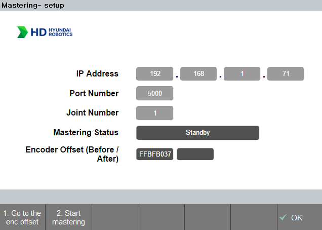
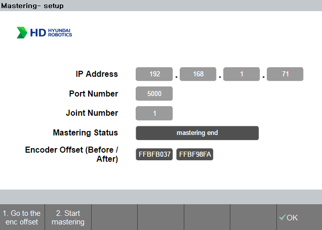

## 3.1. Environment & process
### 3.1.1 Environment
- Before mastering is performed, the mastering kit must be installed near the `V-groove`.
 Otherwise, an `'ERROR_VAL_THRESHOLD'` error may be returned.
- Operates only in manual mode and motor on.
- Please holding the enable switch until the operation ends.

 
 

### 3.1.2 Operation process - summary
1. In [Standby mode](../../02_about_kit/3-com_initialization/README.md), enter the joint number then press the '`shift + OK`' for saving configuration.
2. Click the '`1.Go to the enc offset`' button.
3. After step 2., click the '`2.Start mastering`' button.
4. After step 3., enter the next target joint number, do step 2. again.
5. After completing the mastering process for all joints, save the corrected encoder offset values using the procedures listed below.
   - `home` > `supervisor mode(R button + 314)` > `system` > `3: Robot parameter` > `4: Encoder offset` > `shift + OK` > `OK`

 
 

### 3.1.3 Operation process - Details
- Each joint follows below procedures.
- Procedure status will be displayed on the mastering status block.
  
|Order|Mastering status|Contents|
|:---:|:---:|:---|
|(1)|Standby|Initial image when entering the mastering app.|
|(2)|go to the offset pose...|The state when '`1.Go to the enc offset`' button is pressed.|
|(3)|reached the offset pose.|Complete message after '`1.Go to the enc offset`' operation.|
|(4)|Start mastering.|The first state of '`2.Start mastering`' button is pressed.|
|(5)|move to P1.|The state of moving to p1 direction after '`2.Start mastering`' button is pressed.|
|(6)|move to P2.|The state of moving to p2 direction after '`2.Start mastering`' button is pressed.|
|(7)|apply corrected enc offset.|The state of moving to the modified origin after mastering is completed.|
|(8)|mastering end.|The state of mastering is finished.|

- After completing (1) to (8) for current joint, enter the next joint number then press the '`shift + OK`' to update joint info.
- After updating the joint status, repeat the steps from (2) to (8) above.
- After completing the mastering process for all joints, save the corrected encoder offset values using the procedures listed below.
   - `home` > `supervisor mode(R button + 314)` > `system` > `3: Robot parameter` > `4: Encoder offset` > `shift + OK` > `OK`

 
 

### 3.1.4 Results - image

- The encoder offset value is displayed on the `Encoder Offset(Before/After)` by the unit of `bit(hexa)`.
  - `Left block` : `Pre`-encoder offset value `before mastering`.  
  - `Right block` : `Post`-encoder offset value `after mastering`.  

      

      
       
      Fig 3-1.&nbsp;&nbsp;&nbsp;&nbsp;a. Standby mode image
      &nbsp;&nbsp;&nbsp;&nbsp;
      b. Mastering complete image
      

 
 

### 3.1.5 Reference
- The reason of using `bit` for display encoder offset values.
  - It is intuitive to display angle differences when comparing mastery results, however changes of smaller than 0.01 cannot be assessed.
  - The current mastering process shifts the origin by between -1.5 and 1.5 degrees.
  - It is more accurate to display the encoder value in bit units in order to convey these minute variances.

