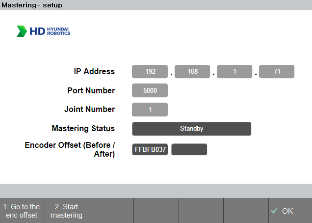
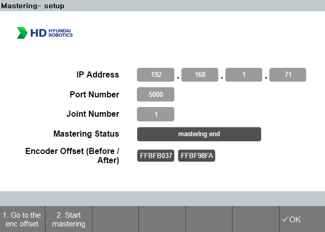

## 3.1. Environment & process
### 3.1.1 Environment

**Before starting mastering, `the tip of the mastering sensor` must be nearby `V-groove`.  
Violation of this may result in `damage to the sensor tip` or return an `ERROR_VAL_THRESHOLD` error.**

- Operates only in manual mode and motor on.
- Please holding the enable switch until the operation ends.

 
 

### 3.1.2 Operation process - summary
1. Enter `engineer mode`    
2. Encoder offset correction - by direct teaching  
3. Encoder offset correction - by using plugin  
    (1) Enter the mastering plugin.  
    (2) In [standby mode](../../02_about_kit/3-com_initialization/README.md), enter the joint number > `Shift + OK` > `OK`  
    (3) Re-entry into the mastering plug-in.   
    (4) Click `1.Go to the enc offset` button.  
    (5) Mount the sensor on the joint.    
    (6) Make sure the end of the sensor is near the `V-groove`.  
    (7) Click the `2.Start mastering` button.  
    (8) Click `OK` when finished.  
    (9) Please remove the sensor.  
    (10) If there are additional axes that need to be mastered, proceed again from (1).  
4. After mastering of all axes is completed, move to the updated encoder origin.
5. Check whether encoder offset is corrected after mastering.  
    
 
 

### 3.1.3 Operation process - Details
1. Encoder offset correction - by direct teaching  
    1-a) Use the teach pendant (TP) to jog the robot to align the V-groove or scale bar attached to the robot.  
    1-b) Resets the encoder offset to a visually aligned position for individual or all joint.  
    - Enter the encoder offset setup page  
    &rightarrow; `TP` > Enter the `Engineer Mode` (R-Button + 314) > `System` > `3: Robot parameter` > `4: Encoder offset`  
    - Proceed with encoder offset initialization  
        (1) When resetting individual joint:  
        → Click `Corrrected encoder` value of the corresponding joint > Click `Reset one` > `Shift + OK` > `OK`   
        (2) When resetting all joint:  
        → Click `Reset all` > `Shift + OK` > `OK`  

 

2. Encoder offset correction - by using plugin  
    (1) After completing the steps in 1, enter the mastering plugin  
        &rightarrow; `TP` > `system` > `4: Application parameter` > `Mastering`  
    (2) Enter the joint number in `Joint Number` > Click `Confirm`  
    (3) Re-enter the mastering plugin to make sure the joint settings are correct.  
    (4) If it's okay, `motor on` > `enable switch on` > Click `Go to the enc offset`.    
        &rightarrow; Move to the origin position of the previously set.  
    (5) Mount the sensor on the joint entered in (2).  
        

        
         Fig 3.1.1. Mastering sensor installation image (left: render image, right: real image)
        

    (6) Make sure the sensor tip is near the V groove.  
        &rightarrow; If it is not located in the V groove, remove the sensor and repeat step 2 above.  
    (7) 2. Click the `2. Start Mastering`.    
    (8) When mastering is complete, click `OK`.  
    (9) Remove the sensor.  
    (10) If there are additional joint to mastering, proceed again from (1).  

 

3. After mastering of all axes is completed, move to the updated encoder origin.
    - `TP` > `system` > `3: Robot parameter` > `4: Encoder offset` > `Moving` > `Shift + OK` > `OK`  
    - The `Corrected encoder` has already been updated, so its value will not change even if the robot moves to the origin.  

 

4. Check whether encoder offset is corrected after mastering.  
    - `TP` > `system` > `3: Robot parameter` > `4: Encoder offset`  
    - Please check whether the encoder offset value updated through mastering is the same as the `Corrected encoder` value.  
    - Check whether the `Current encoder` value for each axis is `0x400000`.  

 
 

### 3.1.4 Test Process - Status Bar Log
|Order|Mastering status|Contents|
|:---:|:---:|:---|
|(1)|Standby|Initial image when entering the mastering app.|
|(2)|go to the offset pose...|The state when '`1.Go to the enc offset`' button is pressed.|
|(3)|reached the offset pose.|Complete message after '`1.Go to the enc offset`' operation.|
|(4)|Start mastering.|The first state of '`2.Start mastering`' button is pressed.|
|(5)|move to P1.|The state of moving to p1 direction after '`2.Start mastering`' button is pressed.|
|(6)|move to P2.|The state of moving to p2 direction after '`2.Start mastering`' button is pressed.|
|(7)|apply corrected enc offset.|The state of moving to the modified origin after mastering is completed.|
|(8)|mastering end.|The state of mastering is finished.|

 
 

### 3.1.5 Results - image

- The encoder offset value is displayed on the `Encoder Offset(Before/After)` by the unit of `bit(hexa)`.
  - `Left block` : `Pre`-encoder offset value `before mastering`.  
  - `Right block` : `Post`-encoder offset value `after mastering`.  

      

      
       
      Fig 3.1.2.&nbsp;&nbsp;&nbsp;&nbsp;a. Standby mode image
      &nbsp;&nbsp;&nbsp;&nbsp;
      b. Mastering complete image
      

 
 

### 3.1.6 Reference
- The reason of using `bit` for display encoder offset values.
  - It is intuitive to display angle differences when comparing mastery results, however changes of smaller than 0.01 cannot be assessed.
  - The current mastering process shifts the origin by between -1.5 and 1.5 degrees.
  - It is more accurate to display the encoder value in bit units in order to convey these minute variances.

