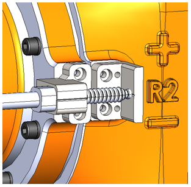
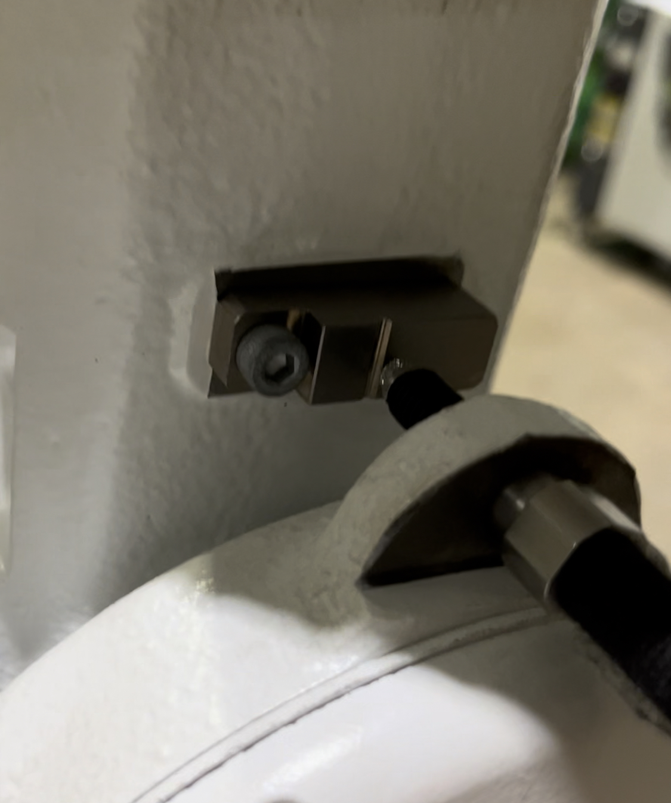
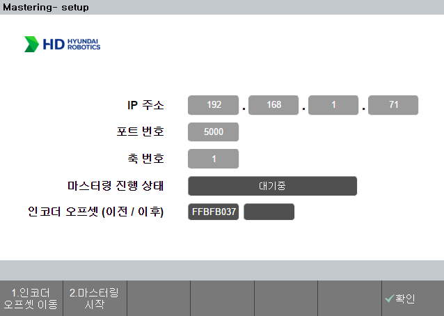
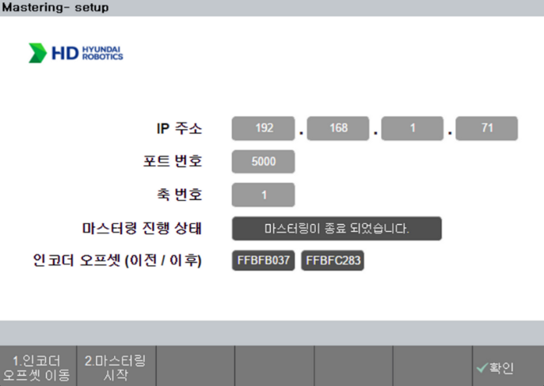

## 3.1. 시험 환경 및 과정  

#### 3.1.1 시험 환경


**마스터링 수행 전, `대상 축에 대해` 육안 상으로 `V홈`을 맞추고 `엔코더 오프셋 초기화`를 진행합니다.  
이를 어길 시 `센서 팁 손상`을 초래하거나 `ERROR_VAL_THRESHOLD` 에러 반환을 하게 됩니다.**

- 수동 모드, 모터 온 상태에서 동작합니다.
- 동작이 종료될 때까지 반드시 `이네이블 스위치`를 잡아 주어야합니다.
- 엔코더 오프셋 수치를 확인하거나 보정하는 경우 `엔지니어 모드(R: 314)`가 필요합니다. 

#### 3.1.2 시험 과정 - 요약
1. `엔지니어 모드(R버튼 + 314)` 진입
2. 엔코더 옵셋 보정 - 육안 상  
3. 엔코더 옵셋 보정 - 플러그인 기반  
    (1) `마스터링 플러그인` 진입  
    (2) [대기 화면](../../02_about_kit/3-com_initialization/README.md)에서 `마스터링 대상 축 번호` 입력 > `확인`  
    (3) `마스터링 플러그인` 재진입  
    (4) 모터 온 > `1.엔코더 오프셋 이동` 버튼 클릭  
    (5) 센서 장착    
    (6) V홈 근처에 센서 팁이 위치했는지 확인  
    (7) `2.마스터링 시작` 버튼 클릭  
    (8) 완료 시 `확인` 클릭  
    (9) 센서 탈착  
    (10) 추가로 마스터링 해야하는 축이 있을 시 후 (1) 부터 재진행  
4. 전 축 마스터링 완료 후 갱신된 `보정된 엔코더 원점`으로 이동
    - `시스템` > `3: 로봇 파라미터` > `4: 엔코더 옵셋` > `로봇 이동`  
    - `shift + 확인` > `확인`  
5. 마스터링 후 보정된 엔코더 옵셋 보정 여부 확인  
    - `보정된 엔코더` 값이 `엔코더 오프셋(이후)` 값과 동일한지 확인  
    - `현재 엔코더` 값이 `0x400000` 인지 확인  

#### 3.1.3 시험 과정 - 상세  
1. `엔지니어 모드(R버튼 + 314)` 진입  

2. `육안` 상 엔코더 오프셋 보정  
    - `시스템` > `3: 로봇 파라미터` > `4: 엔코더 옵셋` > `로봇 이동`  
    - 전 축 스케일 바의 틀어짐을 정도를 확인합니다.  
    - 스케일 바가 많이 뒤틀어진 경우, 직접 조그를 하여 스케일 바를 맞춘 상태에서 엔코더 옵셋 초기화를 진행합니다.  
        - case1) 축 별 엔코더 오프셋 보정 시  
            1) 해당 축을 조그하여 스케일 바를 일치 시킵니다.  
            2) `시스템` > `3: 로봇 파라미터` > `4: 엔코더 옵셋` > 현재 축의 `보정된 엔코더 값` 클릭 > `단일 초기화` 클릭 > `shift + 확인` > `확인`  
        - case2) 전 축 동시에 엔코더 오프셋 보정 시  
            1) 전 축을 조그하여 스케일 바를 육안으로 일치 시킵니다.  
            2) `시스템` > `3: 로봇 파라미터` > `4: 엔코더 옵셋` > `전체 초기화` 클릭 > `shift + 확인` > `확인`  

3. `마스터링 기반` 엔코더 오프셋 보정  
    (1) `시스템` > `4: 응용 파라미터` > `마스터링` 진입  
    (2) 마스터링 대상 축 번호를 `축 번호`에 입력한 다음 `확인` 버튼을 누릅니다.  
    (3) 마스터링 플러그인 재진입 후, 축 번호가 올바르게 설정됐는지 확인합니다.  
    (4) 이상이 없으면 `모터 온`을 하고 `1.엔코더 오프셋 이동` 버튼을 클릭합니다.  
        &rightarrow; 기존 설정된 보정된 엔코더의 원점 위치로 이동합니다.   
    (5) (2)에서 입력한 축에 `센서를 장착`합니다.  
    (6) 센서 팁이 V홈 근처에 위치했는지 확인합니다.    
        &rightarrow; V홈에 위치하지 않는 경우, 센서 탈착 후 상기 2. 과정 재진행합니다.  
        

        
        
         Fig 3.1-1. 마스터링 키트 장착 예시 (좌측: 렌더 이미지, 우측: 실제 체결 이미지) 
        

    (7) `2. 마스터링 시작` 버튼을 클릭합니다.  
    (8) 마스터링 완료 시 `확인` 클릭합니다.    
    (9) `센서를 탈착`합니다.  
    (10) 추가로 마스터링 해야하는 축이 있을 시 후 (1)부터 재진행합니다.  

4. 전 축 마스터링 완료 후 갱신된 `보정된 엔코더 원점`으로 이동
    - `시스템` > `3: 로봇 파라미터` > `4: 엔코더 옵셋` > `로봇이동` > `shift + 확인` > `확인`  
    - 마스터링을 통해 V홈 중앙을 기준으로 엔코더 옵셋이 새롭게 설정되어 `보정된 엔코더`값이 갱신된 상태입니다.  
    - 이에 따라 엔코더 옵셋 설정 화면에서 `로봇이동`을 하게되면 새로 갱신된 `보정된 엔코더`의 원점으로 이동하게됩니다.    
    

5. 마스터링 후 엔코더 오프셋 보정 여부 확인  
    - `시스템` > `3: 로봇 파라미터` > `4: 엔코더 옵셋` 
    - 축 별 `보정된 엔코더`의 값이 `마스터링 된 후의 엔코더 오프셋` 값인지 확인.  
    - 축 별 현재 엔코더 값이 `0x400000` 값인지 확인.  

#### 3.1.4 시험 과정 - 상태 표시 줄 로그
  

|순서|진행 상태 표시|내용|
|:---:|:---|:---|
|(1)|대기중|처음 app을 실행시켰을 때의 화면|
|(2)|오프셋 포즈로 움직입니다...| `1.엔코더 오프셋 이동` 버튼 클릭 시 로봇이 움직이는 상태 |
|(3)|오프셋 포즈에 도달하였습니다.|`1.엔코더 오프셋 이동` 정상 수행 완료 상태|
|(4)|마스터링을 시작합니다.|`2.마스터링 시작` 버튼 클릭 시 로봇이 움직이기 시작하는 상태|
|(5)|p1로 가는 중입니다.|`2.마스터링 시작` 버튼 클릭 후 로봇이 p1 방향(시작점에서 +3도)으로 움직이는 상태|
|(6)|p2로 가는 중입니다.|`2.마스터링 시작` 버튼 클릭 후 로봇이 p2 방향(도착점에서 -3도)으로 움직이는 상태|
|(7)|수정된 엔코더 오프셋을 적용합니다.|마스터링 완료 후 수정된 원점으로 움직이는 상태|
|(8)|마스터링이 종료되었습니다.|보정된 엔코더 오프셋이 보정되고 마스터링이 종료된 상태|

#### 3.1.5 시험 결과 - 이미지

  

    
    

      Fig 3.1-2. a. 대기 화면
    

  

  

    
    

      Fig 3.1-2. b. 마스터링 종료 화면
    

  

`엔코더 오프셋(이전/이후)`에는 엔코더 오프셋 값(`bit`)이 표기됩니다.  
- `왼쪽` 칸 : `마스터링 이전`의 엔코더 오프셋 수치(보정된 엔코더 값)  
- `오른쪽` 칸 : `마스터링 이후`의 엔코더 오프셋 수치(보정된 엔코더 값)  

#### 3.1.6 참고
- 마스터링 결과값을 각도가 아닌 엔코더(bit) 단위로 표시하는 이유
  - 미세 변화 식별: 각도 단위는 0.01° 이하의 미세한 변화를 표시하지 못합니다.
  - 정밀도 확보: 마스터링은 -1.5° ~ +1.5° 사이의 초정밀 구간에서 수행되므로, 이를 정확히 표현하기 위해 더 세밀한 bit 단위를 사용합니다.
