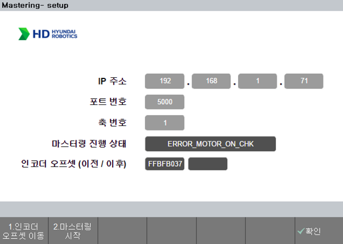
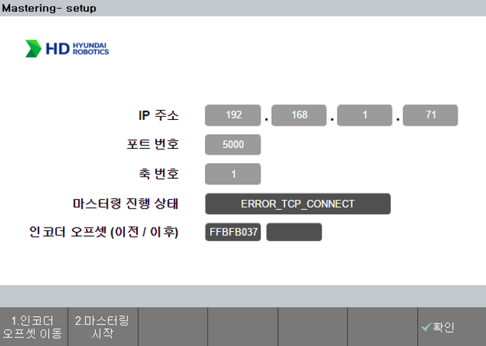

## 3.2. 동작 에러 코드
### 3.2.1 에러 화면 예시
- 마스터링 수행 도중 에러 발생 시, `마스터링 진행 상태`에서 에러코드가 출력됩니다.
- ex) `ERROR_TCP_CONNECT`에러, `ERROR_MOTOR_ON_CHK`에러

 
Fig 3-2. 에러 상태 표시 이미지 

 
 

### 3.2.2 에러 내용 요약
- 마스터링 수행 도중 발생 가능한 에러 리스트입니다.

|에러코드|내용|조치 사항|
|:---|:---|:---|
|`ERROR_MOTOR_ON_CHK`|모터 오프 상태에서 마스터링 시도|모터 온 상태에서 마스터링을 수행하세요.|
|`ERROR_MOTOR_OFF_CHK`|마스터링 수행 시 모터 오프 감지| 마스터링 수행 시 기능 종료까지 Enable SW를 놓지 마세요. 초기 자세로 돌아가 마스터링을 재실행 하세요.|
|`ERROR_VAL_THRESHOLD`|동작 중 Threshold 이상의 V홈을 감지하지 못함|V홈이 탐지되지 않았습니다. 1번 클릭 후 센서를 V홈 근처에 놓고 마스터링을 재진행해주세요.|
|`ERROR_NO_SENSOR_VALS`|기록된 센서데이터가 없습니다.|초기 자세로 돌아가 마스터링을 재실행 하세요. 반복적인 문제 발생시 plug-in APP 소프트웨어를 확인하세요.|
|`ERROR_NO_ENC_VALS`|기록된 엔코더 데이터가 없습니다.|초기 자세로 돌아가 마스터링을 재실행 하세요. 반복적인 문제 발생시 plug-in APP 소프트웨어를 확인하세요.|
|`ERROR_TCP_RES_FAIL`| TCP/IP 통신 response fail | 접촉식 센서의 연결 상태 및 설정 환경을 확인하세요. |
|`ERROR_TCP_RES_NULL`| TCP/IP 통신 response null | 접촉식 센서의 연결 상태 및 설정 환경을 확인하세요.|
|`ERROR_TCP_CONNECT` | TCP/IP 통신 Open 에러 | 접촉식 센서의 연결 상태 및 설정 환경을 확인하세요. |
|`ERROR_PLAYBACK` | Playback 실행 에러 | 제어기 재기동을 진행해주세요. |

