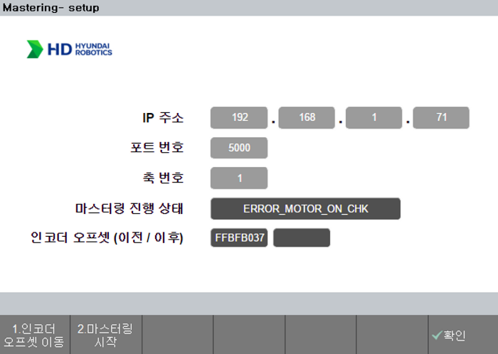
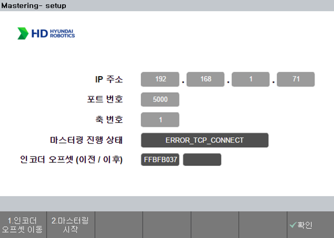

## 3.2. 동작 에러 코드

#### 3.2.1 에러 화면 예시
- 마스터링 수행 도중 에러 발생 시, `마스터링 진행 상태`에서 에러코드가 출력됩니다.
- ex) `ERROR_TCP_CONNECT`에러, `ERROR_MOTOR_ON_CHK`에러
    

      

        
        

          <strong>Fig 3-2. a.</strong> Motor ON 에러 상태
        

      

      

        
        

          <strong>Fig 3-2. b.</strong> TCP 연결 에러 상태
        

      

    

#### 3.2.2 에러 관련
- 마스터링 완료 후 엔코더 값이 `이후`칸에 표시 않으면 `확인`버튼을 눌러 재진입바랍니다.  
- 지속적으로 `ERROR_TCP_CONNECT` 가 뜨는 경우, 이더넷이 연결을 재확인바랍니다.  
    

    
    |제어기 예상 IP|오조립으로 인한 실제 제어기 IP|마스터링 키트에 설정된 IP|비고|
    |:---|:---|:---|:---|
    |192.168.1.150|192.168.3.150|192.168.1.71|실제 제어기는 3대역대, 키트는 1대역대 이므로 통신 불가|  
    - 실제 현장에서 발생했던 케이스입니다.  
    - 해당 경우, 제어기 조립을 다시 하거나, TP 의 네트워크 설정을 재설정 하거나, 마스터링 키트 IP 세팅을 3대역 폭으로 맞추면 해결할 수 있습니다.  
    - 키트 ip 세팅은 [2.2.2 접촉식 센서 통신 설정](../../02_about_kit/2-kit_initialization/README.md)를 참조해서 진행할 수 있습니다.  

    

- 다음은 마스터링 수행 도중 발생 가능한 에러 리스트입니다.  
    

    |에러코드|내용|조치 사항|
    |:---|:---|:---|
    |`ERROR_MOTOR_ON_CHK`|모터 오프 상태에서 마스터링 시도|모터 온 상태에서 마스터링을 수행하세요.|
    |`ERROR_MOTOR_OFF_CHK`|마스터링 수행 시 모터 오프 감지| 마스터링 수행 시 기능 종료까지 Enable SW를 놓지 마세요. 초기 자세로 돌아가 마스터링을 재실행 하세요.|
    |`ERROR_VAL_THRESHOLD`|동작 중 Threshold 이상의 V홈을 감지하지 못함|V홈이 탐지되지 않았습니다. 1번 클릭 후 센서를 V홈 근처에 놓고 마스터링을 재진행해주세요.|
    |`ERROR_NO_SENSOR_VALS`|기록된 센서데이터가 없습니다.|초기 자세로 돌아가 마스터링을 재실행 하세요. 반복적인 문제 발생시 plug-in APP 소프트웨어를 확인하세요.|
    |`ERROR_NO_ENC_VALS`|기록된 엔코더 데이터가 없습니다.|초기 자세로 돌아가 마스터링을 재실행 하세요. 반복적인 문제 발생시 plug-in APP 소프트웨어를 확인하세요.|
    |`ERROR_TCP_RES_FAIL`| TCP/IP 통신 response fail | 접촉식 센서의 연결 상태 및 설정 환경을 확인하세요. |
    |`ERROR_TCP_RES_NULL`| TCP/IP 통신 response null | 접촉식 센서의 연결 상태 및 설정 환경을 확인하세요.|
    |`ERROR_TCP_CONNECT` | TCP/IP 통신 Open 에러 | 접촉식 센서의 연결 상태 및 설정 환경을 확인하세요. |
    |`ERROR_PLAYBACK` | Playback 실행 에러 | 제어기 재기동을 진행해주세요. |

    

