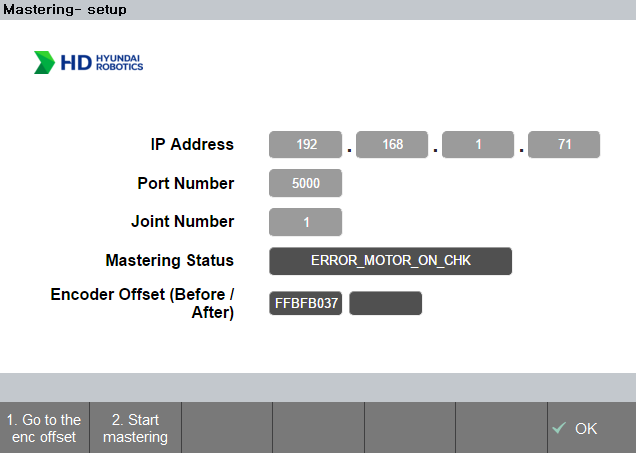
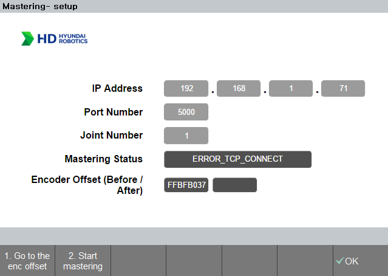

## 3.2. Error Code for Mastering

#### 3.2.1 Error Image
- If an error occurs during mastering operation, an error code is output in 'Mastering Progress Status'.
- ex) `ERROR_TCP_CONNECT`, `ERROR_MOTOR_ON_CHK`
    

      <table style="margin-left: 0; border: none; border-collapse: collapse; width: 500px; table-layout: fixed;">
        <tr>
          <td style="border: none; padding: 0;">
            
          </td>
        </tr>
        <tr>
          <td style="border: none; padding: 8px 0 25px 0; font-size: 0.9em; line-height: 1.4;">
            Fig 3.2.1. a. Error: Motor must be ON for mastering.
          </td>
        </tr>
        <tr>
          <td style="border: none; padding: 0;">
            
          </td>
        </tr>
        <tr>
          <td style="border: none; padding: 8px 0 10px 0; font-size: 0.9em; line-height: 1.4;">
            Fig 3.2.1. b. Error: TCP connection failed with the sensor.
          </td>
        </tr>
      </table>
    

 

#### 3.2.2 Summary of Errors
This is a list of errors that can occur while performing mastering operations.  

|Error Code|Contents|Todo List|
|:---|:---|:---|
|`ERROR_MOTOR_ON_CHK`|Try mastering with the motor off.|Perform mastering with the motor on.|
|`ERROR_MOTOR_OFF_CHK`|Motor off detection when performing mastering.|When performing mastering, do not release the Enable SW until the function ends. Return to the initial position and re-execute mastering.|
|`ERROR_VAL_THRESHOLD`|`V-groove` was not detected during mastering.|V-home was not detected. After clicking button 1, place the sensor near the `V-groove` and resume mastering.|
|`ERROR_NO_SENSOR_VALS`|There is no sensor data recorded.|Return to the initial position and re-execute mastering. If repeated problems occur, check the plug-in APP software.|
|`ERROR_NO_ENC_VALS`|There is no encoder data recorded.|Return to the initial position and re-execute mastering. If repeated problems occur, check the plug-in APP software.|
|`ERROR_TCP_RES_FAIL`| TCP/IP communication response fail. | Check the connection status and setting environment of the contact sensor. |
|`ERROR_TCP_RES_NULL`| TCP/IP communication response null. | Check the connection status and setting environment of the contact sensor. |
|`ERROR_TCP_CONNECT` | TCP/IP communication connection fail. | Check the connection status and setting environment of the contact sensor. |
|`ERROR_PLAYBACK` | Playback Error. | Please restart the controller. |

