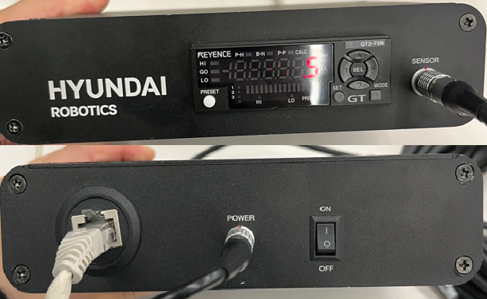

# Hi6 마스터링 기능 설명서


본 제품 설명서에서 제공되는 정보는 현대로보틱스의 자산입니다.

현대로보틱스의 서면에 의한 동의 없이 전부 또는 일부를 무단 전재 및 재배포할 수 없으며, 제3자에게 제공되거나 다른 목적에 사용할 수 없습니다.

본 설명서는 사전 예고 없이 변경될 수 있습니다.

**Copyright ⓒ 2023 by HD Hyundai Robotics**
# 1. 개요

로봇 마스터링에 대한 간략한 설명을 합니다.  
마스터링의 여러 기법들 중 접촉식 센서 기반의 로봇 마스터링에 대해서 설명을 진행합니다.  

- [1.1 로봇 마스터링 기능이란?](./1-about_mastering/README.md)
- [1.2 접촉식 센서 기반 로봇 마스터링 기능](./2-about_contact_based_mastering/README.md)
    - 1.2.1 시스템 환경
    - 1.2.2 동작 환경
    - 1.2.3 동작 요약
    - 1.2.4 동작 과정## 1.1 로봇 마스터링 기능이란?

- 로봇 출하 시 혹은 현장에서 축 뒤틀림 현상 혹은 구동원 교체 같은 사유가 발생하는 경우, 
  로봇의 기계적 원점이 달라지는 경우가 있습니다. 이 때에 마스터링 기능을 필요로하게 됩니다. 
  마스터링이란 기계적 원점을 보정하며 로봇 모션의 정확도를 높이기 위해 사용되는 기능입니다.

 

- 해당 문서는 접촉식 센서를 기반으로 마스터링을 진행합니다.  
  센서가 시작점을 기준으로 -1.5 도에서 +1.5 도로 움직이면서 V홈을 탐지합니다.  
  최종 V홈으로 탐지된 곳이 기계적 원점으로 보정됩니다.

 
Fig 1-1. 마스터링 시작 전 V홈 탐지전(좌측), 마스터링 진행 중 V홈 탐지(우측)

## 1.2 접촉식 센서 기반 로봇 마스터링 기능

본 사용설명서는 `접촉식 센서 기반` 로봇 마스터링 기능에 대한 내용을 담고 있습니다.  
해당 마스터링 키트와 기능의 활용으로 보다 정밀한 보정이 가능합니다.

 

### 1.2.1. 시스템 환경
- **로봇**  - 마스터링 블록 장착 모델
- **Hi6 로봇 제어기**  - app 설치
- **마스터링 키트**  - 컨트롤러 + 전원

 

### 1.2.2. 동작 조건
- 로봇의 동작 모드는 `수동 모드`로 설정이 되어 있어야 합니다.
- 반드시 `이네이블 스위치`를 활성화 한 `모터 온 상태`에서 동작을 수행할 수 있습니다.

 

### 1.2.3. 동작 요약
- 로봇의 각 축 별로 존재하는 V홈을 접촉식 센서가 스캐닝을 하여 그 중간 점을 찾아 원점으로 보정하는 동작을 합니다.

 

### 1.2.4. 동작 과정
- 접촉식 센서는 아래 그림과 같이 체결 됩니다.
- 센서가 `V홈`(아래 그림의 파인 부분)을 상하 또는 좌우로 지나갑니다.
- `V홈`을 지나면서 달라지는 센서 값을 기준으로 `V홈`의 중앙 지점을 파악합니다.
- 파악이 완료되면, 해당 중앙 지점을 기준으로 인코더 오프셋을 진행하여 원점 보정을 진행합니다.
    

    
     Fig 1-1. 마스터링 키트 장착 예시 (좌측: 렌더 이미지, 우측: 실제 체결 이미지)
    
# 2. 마스터링 키트 구성 및 설정

접촉식 마스터링에 사용되는 키트에 대한 설명을 진행합니다.  
센서 초기화와 마스터링 플러그인 설치 과정에 대해 설명합니다.  

- [2.1 마스터링 키트 구성](../02_about_kit/1-kit_description/README.md)
  - 2.1.1 접촉식 센서 구성품
  - 2.1.2 접촉식 센서 연결 및 사양

 

- [2.2 초기 설정 및 연결](../02_about_kit/2-kit_initialization/)
  - 2.2.1 접촉식 센서 초기화
  - 2.2.2 접촉식 센서 통신 설정

- [2.3 제어기 설정](../02_about_kit/3-com_initialization/README.md)
  - 2.3.1 마스터링 플러그인 설치
  - 2.3.2 마스터링 기능 설정## 2.1 키트 구성

### 2.1.1 접촉식 센서 구성품

- **센서 및 전원 어댑터** 
    

    
    
    

    Fig 2-1. 마스터링 센서와 통신 모듈
     

     

- **케이블**   
    

    
    

    Fig 2-2. 전원 어댑터와 이더넷 케이블
     

 

- **소프트웨어**
 본 패키지에는 마스터링 기능 APP 과 컨트롤러 설정 프로그램이 포함되어있습니다.

 
 

### 2.1.2 접촉식 센서 연결 및 사양
- 센서 연결을 Fig2-1 의 우측 사진과 같이 연결하면 됩니다.
- 마스터링 키트는 하기와 같은 인터페이스 사양을 가지고 있습니다.

    |속성|내용|
    |:----:|:----|
    |`센서 타입`| `접촉식` 센서 |
    |`통신 지원`| `Ethernet`(TCP/IP) |
    |`통신 주기`| `5 msec` |

 
 ## 2.2 센서 초기 설정 및 연결
### 2.2.1 접촉식 센서 초기화
- **초기화는 <u>체결 전 하나의 축에 대해서 한번만</u> 진행하면 됩니다.** 
- !!! 주의 !!! 
  - 체결 후, 센서의 측정값이 Fig 2-3.a 처럼 `음수`가 나오면 마스터링 진행이 불가합니다.
  - 따라서, Fig 2-3.a 와 같이 `센서를 들고 있는 상태`에서 `프리셋 버튼`을 눌러 주시기 바랍니다.
  - 프리셋 이 후, 센서에 압력이 가해졌을 때 Fig 2-3.c 처럼 양수 값이 측정되는지 확인합니다.
  - **축을 바꿔 체결할 때마다, 측정 되는 수치가 양수인지 반드시 확인 해야합니다.**

    

    
    
     
    Fig 2-3. a. 센서를 들었을 때의 음의 수치 
    &nbsp;&nbsp;&nbsp;&nbsp;&nbsp;&nbsp;&nbsp;&nbsp;&nbsp;&nbsp;&nbsp;&nbsp;
    b. preset 버튼을 누르는 장면
    &nbsp;&nbsp;&nbsp;&nbsp;&nbsp;&nbsp;&nbsp;&nbsp;&nbsp;&nbsp;&nbsp;&nbsp;
    c. 센서를 눌렀을 때 양의 수치
    

 
 

### 2.2.2 접촉식 센서 통신 설정
- 마스터링 컨트롤러의 설정 프로그램은 소프트웨어 패키지에 포함되어 있습니다. 별도의 PC에 해당 프로그램을 설치합니다.
- **<u>보안 프로그램이 적용된 사내 노트북이나 데스크탑은 IP Search 가 되지 않습니다</u>**
- 별도의 PC와 마스터링 컨트롤러를 연결한 뒤 해당 프로그램을 통해 통신 IP주소와 포트 번호를 설정할 수 있습니다.
- 해당 프로그램은 회원가입 후 사용하실 수 있습니다.
- 통신 설정 후 [Fig 2-1의 통신 모듈](../../02_about_kit/1-kit_description/README.md)과 같이 마스터링 통신 모듈과 Hi6 제어기를 이더넷 케이블로 연결합니다.

    

    

    Fig 2-4. 마스터링 컨트롤러 설정 프로그램 [DL-EN1 IP configurator](https://www.keyence.co.kr/download/download/confirmation/?dlAssetId=AS_135945&dlSeriesId=&dlModelId=&dlLangId=&dlLangType=en-GB)
     - `Network Adaptor` : 연결 PC의 네트워크 어댑터 정보
     - `IP Search Range` : IP 주소 검색 범위(기 설정 되어있는 IP 주소를 검색)
     - `IP Address/Mac Address` : 기설정된 IP주소과 Mac주소
     - `IP Setting/Reset` : IP 설정 버튼(수정) 및 초기화 버튼 (IP 설정을 바꿀 경우에만 실행)
    
## 2.3 제어기 설정
마스터링 APP 설치가 정상적으로 완료되면, Hi6 로봇 제어기의 설정창을 통하여 마스터링 기능을 수행할 수 있습니다.  
동작을 수행하기 전에 마스터링 설정값들이 반영 되어 있어야하고, 실행 버튼들을 통하여 마스터링의 동작을 수행하게 됩니다.  
동작의 조건과 내용에 대한 이해가 있어야 마스터링을 올바르게 수행할 수 있습니다.  

 

### 2.3.1 마스터링 플러그인 설치
- 해당 기능은 Hi6 SDK를 통해 개발되었으며, 마스터링 App을 Hi6 제어기에 별도로 설치를 해야 사용할 수 있습니다.
- `설치 위치` : /ata0:2/lib/hi6/apps/mastering
- `설치 방법`
    1) Ethernet 연결 후 FTP 통신 방식을 통해 설치.
    2) USB 에 mastering app 을 저장하여 TP 의 `5: 파일관리` 에서 복사 붙여넣기 진행.
- `설치 주의 사항`
    - 설치 후 제어기를 재부팅해야 마스터링 APP을 실행 시킬 수 있습니다.
    - 재부팅 이후 응용프로그램에서 마스터링 APP이 보이지 않을 시, TP 만 재부팅 하십시오.

 

### 2.3.2 마스터링 기능 설정
- `설정 위치`  
    TP : `홈` > `시스템` > `4: 응용 파라미터` > `마스터링`

- `대기 화면` 
    
     
    Fig 2-5. 마스터링 App 화면

- 응용프로그램에서 마스터링 APP이 보이지 않을 시, TP 만 재부팅 하십시오.

     
    Fig 2-6. 마스터링 대기 화면

    * `IP 주소` : 마스터링 키트의 IP 주소를 입력합니다.
    * `포트 번호` : 마스터링 키트의 포트 번호를 입력합니다.
    * `축 번호` : 마스터링을 수행할 대상 축을 설정합니다.
    * `마스터링 진행 상태` : 마스터링 수행 시 상태를 표시합니다.
    * `인코더 오프셋(이전 / 이후)` : 마스터링 수행 전 후의 현재 축의 인코더 오프셋 값(`bit`)을 보여줍니다.
     

 

- 마스터링 IP 및 포트 번호 설정 저장 방법
    1) Fig 2-6. 처럼 마스터링 키트의 ip, port, 축 번호를 입력합니다.  
    ([2.2.2. 접촉식 센서 통신 설정](../2-kit_initialization/README.md)에서 설정한 ip 및 port 를 입력합니다.)

    2) `shift` + `확인` 클릭을 통해 설정 값을 제어기에 저장 및 업데이트 합니다.
# 3. 마스터링 수행

접촉식 센서 기반 마스터링을 수행하는 과정을 설명합니다.  
동작 과정에서 발생하는 에러코드와 필요조치 또한 확인하실 수 있습니다.  

  - [3.1. 마스터링 수행 환경 및 과정](../03_operation/1-mastering_step/README.md)
    - 3.1.1 마스터링 정상 수행 환경
    - 3.1.2 수행 과정 요약
    - 3.1.3 수행 과정 상세
    - 3.1.4 수행 결과 이미지
    - 3.1.4 참고

  - [3.2. 마스터링 에러 코드](../03_operation/2-error/README.md)
    - 3.2.1 에러 화면 예시
    - 3.2.1 에러 내용 요약

## 3.1. 동작 환경 및 과정  

### 3.1.1 동작 환경
- 마스터링이 수행 전, V홈 근처에 마스터링이 체결돼 있어야 합니다.
 그렇지 않은 경우, `ERROR_VAL_THRESHOLD` 에러를 반환할 수 있습니다.
- 수동 모드, 모터 온 상태에서 동작합니다.
- 동작이 종료될 때까지 반드시 이네이블 스위치를 잡아 주어야합니다.

 
 

### 3.1.2 동작 과정 - 요약
1. [대기 화면](../../02_about_kit/3-com_initialization/README.md)에서 축 번호 입력 후 `shift + 확인` 으로 적용
2. `1.인코더 오프셋 이동` 버튼 클릭 
3. 2.가 완료되면, `2.마스터링 시작`버튼 클릭
4. 3.이 완료되면, 1.을 다음 축으로 설정하고 2., 3. 진행
5. 모든 축 마스터링이 완료되면, 아래의 과정을 통해 설정된 축들의 엔코더 오프셋 값들을 적용 및 저장.
   - `홈` > `관리자모드 진입(R버튼 + 314)` > `시스템` > `3: 로봇 파라미터` > `4: 엔코더 옵셋` > `shift + 확인` > `확인`

 
 

### 3.1.3 동작 과정 - 상세
`하나의 축에 대해서` 아래의 (1)~(8)단계를 진행하게 됩니다.
  
|순서|진행 상태 표시|내용|
|:---:|:---:|:---|
|(1)|대기중|처음 app을 실행시켰을 때의 화면|
|(2)|오프셋 포즈로 움직입니다...| `1.인코더 오프셋 이동` 버튼 클릭 시 로봇이 움직이는 상태 |
|(3)|오프셋 포즈에 도달하였습니다.|`1.인코더 오프셋 이동` 정상 수행 완료 상태|
|(4)|마스터링을 시작합니다.|`2.마스터링 시작` 버튼 클릭 시 로봇이 움직이기 시작하는 상태|
|(5)|p1로 가는 중입니다.|`2.마스터링 시작` 버튼 클릭 후 로봇이 p1 방향으로 움직이는 상태|
|(6)|p2로 가는 중입니다.|`2.마스터링 시작` 버튼 클릭 후 로봇이 p2 방향으로 움직이는 상태|
|(7)|수정된 인코더 오프셋을 적용합니다.|마스터링 완료 후 수정된 원점으로 움직이는 상태|
|(8)|마스터링이 종료되었습니다.|보정된 인코더 오프셋이 설정되고 마스터링이 종료된 상태|

- (1)에서 (8)까지 수행 완료 후, 다음 축으로 변경 후 `shift + 확인`을 눌러 축 상태를 저장합니다.
- 변경 된 축 상태 저장을 완료하고, 위의 (2)번부터 (8)까지 수행합니다.
- 모든 축 마스터링이 완료되면, 아래의 과정을 통해 설정된 축들의 엔코더 오프셋 값들을 적용 및 저장.
   - `홈` > `관리자모드 진입(R버튼 + 314)` > `시스템` > `3: 로봇 파라미터` > `4: 엔코더 옵셋` > `shift + 확인` > `확인`

 
 

### 3.1.4 동작 결과 - 이미지

 
Fig 3-1.&nbsp;&nbsp;&nbsp;&nbsp;a.대기 화면(좌측 이미지)
&nbsp;&nbsp;&nbsp;&nbsp;
b. 마스터링 종료 화면(우측 이미지)

 

`인코더 오프셋(이전/이후)`에는 인코더 오프셋 값(`bit`)이 표기됩니다.
  - `왼쪽` 칸 : `마스터링 이전`의 인코더 오프셋 수치
  - `오른쪽` 칸 : `마스터링 이후`의 인코더 오프셋 수치

 
 

### 3.1.5 참고
- 마스터링 결과 값을 인코더 값으로 보여주는 이유
  - 마스터링 결과 비교시, 각도 차이를 보여주는 것이 직관적이나, 0.01 이하의 변화는 측정이 불가합니다. 
  - 현재 마스터링 과정은 원점을 기준으로 -1.5도에서 1.5도를 미세하게 움직입니다.
  - 이러한 미세 차이를 표현하기 위해서는 bit 단위로 인코더 수치를 보여주는 것이 정확합니다.

## 3.2. 동작 에러 코드
### 3.2.1 에러 화면 예시
- 마스터링 수행 도중 에러 발생 시, `마스터링 진행 상태`에서 에러코드가 출력됩니다.
- ex) `ERROR_TCP_CONNECT`에러, `ERROR_MOTOR_ON_CHK`에러

 
Fig 3-2. 에러 상태 표시 이미지 

 
 

### 3.2.2 에러 내용 요약
- 마스터링 수행 도중 발생 가능한 에러 리스트입니다.

|에러코드|내용|조치 사항|
|:---|:---|:---|
|`ERROR_MOTOR_ON_CHK`|모터 오프 상태에서 마스터링 시도|모터 온 상태에서 마스터링을 수행하세요.|
|`ERROR_MOTOR_OFF_CHK`|마스터링 수행 시 모터 오프 감지| 마스터링 수행 시 기능 종료까지 Enable SW를 놓지 마세요. 초기 자세로 돌아가 마스터링을 재실행 하세요.|
|`ERROR_VAL_THRESHOLD`|동작 중 Threshold 이상의 V홈을 감지하지 못함|V홈이 탐지되지 않았습니다. 1번 클릭 후 센서를 V홈 근처에 놓고 마스터링을 재진행해주세요.|
|`ERROR_NO_SENSOR_VALS`|기록된 센서데이터가 없습니다.|초기 자세로 돌아가 마스터링을 재실행 하세요. 반복적인 문제 발생시 plug-in APP 소프트웨어를 확인하세요.|
|`ERROR_NO_ENC_VALS`|기록된 엔코더 데이터가 없습니다.|초기 자세로 돌아가 마스터링을 재실행 하세요. 반복적인 문제 발생시 plug-in APP 소프트웨어를 확인하세요.|
|`ERROR_TCP_RES_FAIL`| TCP/IP 통신 response fail | 접촉식 센서의 연결 상태 및 설정 환경을 확인하세요. |
|`ERROR_TCP_RES_NULL`| TCP/IP 통신 response null | 접촉식 센서의 연결 상태 및 설정 환경을 확인하세요.|
|`ERROR_TCP_CONNECT` | TCP/IP 통신 Open 에러 | 접촉식 센서의 연결 상태 및 설정 환경을 확인하세요. |
|`ERROR_PLAYBACK` | Playback 실행 에러 | 제어기 재기동을 진행해주세요. |

